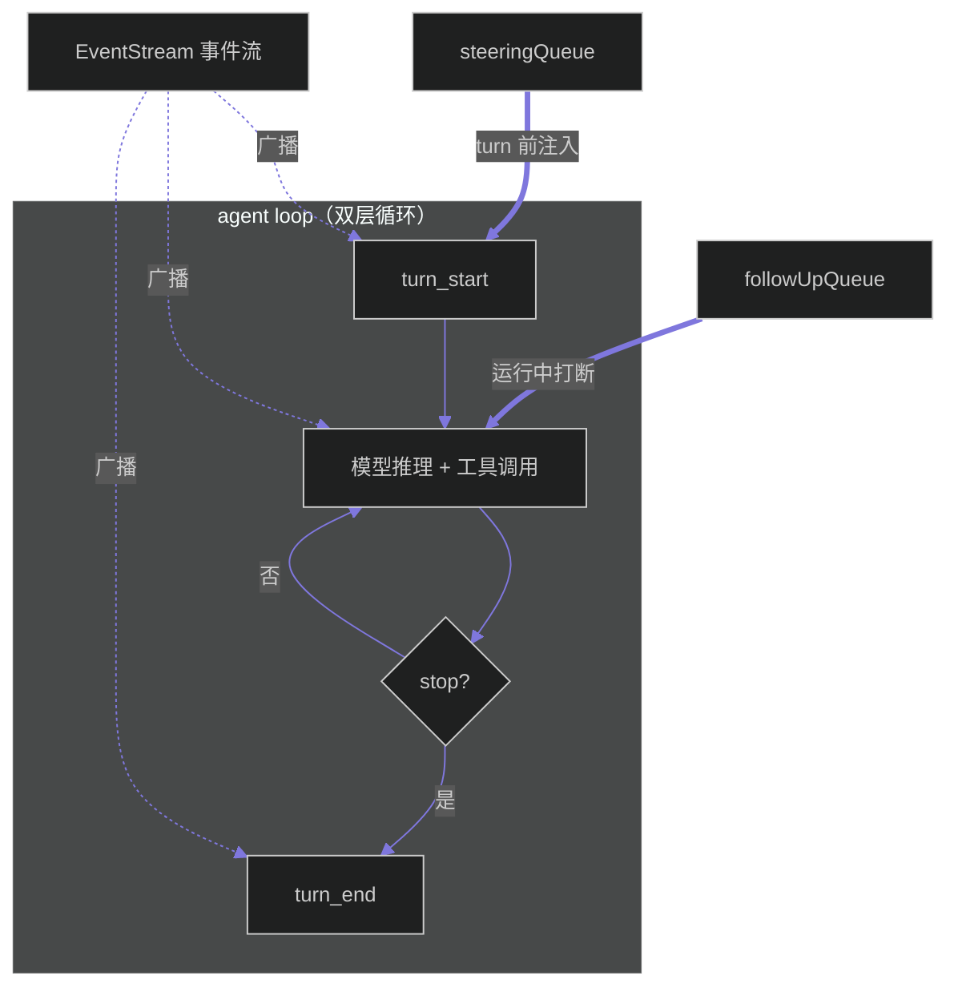

# AI 技术文档模板（章节骨架）

建议的默认章节顺序（可按技术特点增删，但前四节为调研类文档的核心）：

1. **技术背景与动机** — 该技术解决的问题、现有方案的不足、提出动机。
2. **核心架构设计** — 整体架构，配 ASCII 流程图。
3. **关键技术原理** — 分模块深入，给出公式/机制；必要时单列"训练与工程实现"。
4. **性能对比分析** — 离线基准（表格）+ 生产/部署实测 + 与同类工作对比。
5. **应用场景** — 适合落地的场景与前提条件。
6. **局限性** — 已知限制、数据口径陷阱、未来工作。
7. **总结** — 一句话定位与价值。

## Frontmatter 标准格式（必填块）

每份技术文档**顶部必须**带一个 YAML frontmatter 块（紧挨文档第一行，前后各一个 `---`），字段约定如下，对齐 `harness-engineering` 等知识库的真实写法：

```markdown
---
aliases: [pi Agent Harness, pi Coding Agent, 极简 Harness, Minimal Harness, earendil-works/pi]
tags: [Harness, Agent, pi, Minimal-Core, Extension-System, Self-Extensible, Context-Engineering, Anti-MCP, Provider-Agnostic]
related:
  - "./harness-definition.md"
  - "./claude-code-harness.md"
  - "./codex-harness.md"
  - "./harness-engineering.md"
  - "./agent-harness-engineering-survey.md"
  - "./hook.md"
---

# 技术名称（英文原名）

> 论文：<标题>，arXiv:<编号>，<日期>
> 仓库：<org/repo>
> 官方解读：<链接>
```

字段说明：
- `aliases`：别名数组，多写常见叫法（中英文、仓库路径、特征名），便于检索与双链别名命中。
- `tags`：标签数组，统一小写、用连字符代替空格（如 `Minimal-Core` 而非 `Minimal Core`）。
- `related`：关联文档数组（双链回指）。两种写法都正确，按仓库习惯二选一：
  - **路径式**（harness-engineering 等知识库采用）：`"./harness-definition.md"`
  - **Wiki 式**：`"[[harness-definition]]"`
  - 新增一篇文档后，需回到关联文档的 `related` 补回向链接（见阶段 5）。

## 架构/流程图：ASCII 与 Mermaid 的选择

- **简单图**（2–5 个节点、线性或单分支、单链路）：用 **ASCII 框图**（见下例），轻量、可读、无需渲染器。
- **复杂图**（多组件、多层、含子图 / 队列 / 事件流 / 分支树 / 差分渲染管线）：用 **Mermaid**（` ```mermaid ` 代码块）。Obsidian 阅读视图原生渲染，比内联 SVG 文件更稳，且可随主题着色。

### ASCII 架构图示例（简单场景）

```
        ┌─────────────┐
        │   输入序列   │
        └──────┬──────┘
               ▼
        ┌─────────────┐
        │  并行主干    │◄── 半自回归生成
        └──────┬──────┘
               ▼
        ┌─────────────┐
        │ 置信度调度   │◄── 顺序温度缩放(STS)
        └──────┬──────┘
               ▼
        ┌─────────────┐
        │ 接受/拒绝    │
        └─────────────┘
```

### Mermaid 图示例（复杂场景）



Mermaid 注意事项：
- 用 `flowchart`（配 `TB` / `LR` 指定方向）；复杂分层用 `subgraph ID["标题"] ... end`。
- **避免 Mermaid 非法形状** `[("...")]`（圆柱/体育场内嵌括号），队列/标记用普通矩形 `[]` 即可。
- 配色用 `%%{init:{'theme':'dark', themeVariables:{...}}}%%` 锁定，不随主题切换失真（暗色知识库推荐）。
- 节点文本含特殊字符时用引号包裹：`["turn_start"]`；连接子图用 `A ==>|标签| B` 合法。

## 表格示例（性能对比）

| 模型/系统 | 领域 | 平均接受长度 | 吞吐提升 |
|-----------|------|-------------|---------|
| DSpark    | 数学 | 4.2         | +X%     |
| MTP-1     | 数学 | 2.1         | 基线    |

> 注：表格中的数值必须来自已核实来源；若论文给出的是"名义提升"而非"实测提升"，需在表注或正文中明确标注口径，避免误读。
