# CygCode Harness 工程详解 v2

## 目录

- [1. 新架构总体概览 — 从单体到 SDK](#1-新架构总体概览-从单体到-sdk)
  - [1.1 SDK 包结构](#11-sdk-包结构)
  - [1.2 核心运行时层次](#12-核心运行时层次)
  - [1.3 关键文件索引](#13-关键文件索引)
- [2. Harness 的防线模型](#2-harness-的防线模型)
  - [核心问题：SDK 化后如何保证 Agent 不跑偏？](#核心问题sdk-化后如何保证-agent-不跑偏)
  - [防线全景图](#防线全景图)
- [3. 系统提示词与用户消息拼接详解 — SDK 架构下的完整流程](#3-系统提示词与用户消息拼接详解-sdk-架构下的完整流程)
  - [3.1 System Prompt — 两套模板](#31-system-prompt-两套模板)
  - [3.2 占位符注入流程](#32-占位符注入流程)
  - [3.3 Rules 注入的两条路径](#33-rules-注入的两条路径)
  - [3.4 最终 System Prompt 结构](#34-最终-system-prompt-结构)
  - [3.5 用户消息 XML 格式](#35-用户消息-xml-格式)
  - [3.6 每轮对话发送给 LLM 的完整消息数组结构](#36-每轮对话发送给-llm-的完整消息数组结构)
- [4. AgentRuntime — 标准化 Agent 循环与 Completion 门控](#4-agentruntime-标准化-agent-循环与-completion-门控)
  - [4.1 核心循环流程图](#41-核心循环流程图)
  - [4.2 状态机](#42-状态机)
  - [4.3 Completion 门控 — 三层决策树](#43-completion-门控-三层决策树)
  - [4.4 Iteration 硬上限与 Abort](#44-iteration-硬上限与-abort)
  - [4.5 restore() — 对话重置](#45-restore-对话重置)
  - [4.6 流式事件 — 单轮事件序列](#46-流式事件-单轮事件序列)
- [5. 消息管理：对话生命周期与消息传递管道](#5-消息管理对话生命周期与消息传递管道)
  - [消息存储三层架构](#消息存储三层架构)
  - [核心生命周期](#核心生命周期)
  - [5.3 ConversationStore — 跨 Run 的内存持久化](#53-conversationstore-跨-run-的内存持久化)
  - [5.4 MessageBuilder — 每轮 API 调用的安全处理](#54-messagebuilder-每轮-api-调用的安全处理)
  - [5.5 Steering 注入 — consumePendingUserMessage](#55-steering-注入-consumependingusermessage)
  - [5.6 消息编解码 — AgentMessage ↔ Message](#56-消息编解码-agentmessage-message)
  - [5.7 消息管理在防跑偏中的角色](#57-消息管理在防跑偏中的角色)
- [6. Tool 协议与 Tool Policy — 行动硬约束](#6-tool-协议与-tool-policy-行动硬约束)
  - [6.1 工具集合构建](#61-工具集合构建)
  - [6.2 Tool Policy 约束规则](#62-tool-policy-约束规则)
  - [6.3 审批流程](#63-审批流程)
  - [6.4 各工具用法限制速查](#64-各工具用法限制速查)
    - [6.4.1 工具输入与输出限制](#641-工具输入与输出限制)
    - [6.4.2 MessageBuilder 层二次截断（每轮必定执行，无条件）](#642-messagebuilder-层二次截断每轮必定执行无条件)
    - [6.4.3 环境变量覆盖](#643-环境变量覆盖)
    - [6.4.4 实际示例：write_to_file 大文件的两层限制](#644-实际示例write_to_file-大文件的两层限制)
- [7. Hooks](#7-hooks)
  - [7.1 两套体系对比](#71-两套体系对比)
  - [7.2 体系 A：SDK 运行时 Hooks（7 种）](#72-体系-asdk-运行时-hooks7-种)
  - [7.3 体系 B：用户文件脚本 Hooks（8 种）](#73-体系-b用户文件脚本-hooks8-种)
  - [7.4 Hooks 合并策略](#74-hooks-合并策略)
  - [7.5 Hooks 在防跑偏中的角色](#75-hooks-在防跑偏中的角色)
- [8. 安全护栏：MistakeTracker + LoopDetection](#8-安全护栏mistaketracker-loopdetection)
  - [8.1 协作关系图](#81-协作关系图)
  - [8.2 MistakeTracker 工作原理](#82-mistaketracker-工作原理)
  - [8.3 LoopDetectionTracker 工作原理](#83-loopdetectiontracker-工作原理)
  - [8.4 防跑偏联动表](#84-防跑偏联动表)
  - [8.5 防线之间的协作示例](#85-防线之间的协作示例)
- [9. FocusChain / task_progress 的取消与替代](#9-focuschain-task_progress-的取消与替代)
  - [9.1 旧架构中 FocusChain 的作用](#91-旧架构中-focuschain-的作用)
  - [9.2 新架构的替代方案](#92-新架构的替代方案)
- [10. 上下文保鲜：Compaction Pipeline + MessageBuilder](#10-上下文保鲜compaction-pipeline-messagebuilder)
  - [10.1 两层机制的角色区分](#101-两层机制的角色区分)
  - [10.2 Compaction Pipeline — 详细触发条件与策略选择](#102-compaction-pipeline-详细触发条件与策略选择)
    - [10.2.1 触发阈值计算](#1021-触发阈值计算)
    - [10.2.2 三种压缩策略的选择](#1022-三种压缩策略的选择)
    - [10.2.3 压缩目标 Token 计算](#1023-压缩目标-token-计算)
    - [10.2.4 具体触发示例](#1024-具体触发示例)
  - [10.3 Basic Compaction — 五级截断详解](#103-basic-compaction-五级截断详解)
  - [10.4 Agentic Compaction — LLM 语义总结](#104-agentic-compaction-llm-语义总结)
  - [10.5 MessageBuilder — 为何大段写入被截断](#105-messagebuilder-为何大段写入被截断)
    - [10.5.1 截断发生的完整链路](#1051-截断发生的完整链路)
    - [10.5.2 为什么是 8000 字符](#1052-为什么是-8000-字符)
    - [10.5.3 总文本预算截断（6MB 默认）](#1053-总文本预算截断6mb-默认)
    - [10.5.4 如何解决大段写入被截断](#1054-如何解决大段写入被截断)
  - [10.6 MessageBuilder 完整处理流程](#106-messagebuilder-完整处理流程)
  - [10.7 截断参数汇总与调优](#107-截断参数汇总与调优)
  - [10.8 压缩参数](#108-压缩参数)
  - [10.9 上下文保鲜对防跑偏的价值](#109-上下文保鲜对防跑偏的价值)
- [11. 用户可编程控制层：Rules / Skills / Workflows](#11-用户可编程控制层rules-skills-workflows)
  - [11.1 架构总览](#111-架构总览)
  - [11.2 规则目录结构](#112-规则目录结构)
  - [11.3 规则格式](#113-规则格式)
  - [11.4 Hot-Reload 机制](#114-hot-reload-机制)
  - [11.5 Skill 系统](#115-skill-系统)
  - [11.6 Workflow 系统](#116-workflow-系统)
  - [11.7 为什么 Rules 是防跑偏第一层](#117-为什么-rules-是防跑偏第一层)
- [12. PLAN / ACT 双模式](#12-plan-act-双模式)
  - [12.1 设计意图](#121-设计意图)
  - [12.2 模式对比](#122-模式对比)
  - [12.3 模式切换流程](#123-模式切换流程)
  - [12.4 防跑偏价值](#124-防跑偏价值)
- [13. Subagent 系统：多 Agent 架构的防跑偏机制](#13-subagent-系统多-agent-架构的防跑偏机制)
  - [13.1 两套多 Agent 模式对比](#131-两套多-agent-模式对比)
    - [源码级对比：本质并非「父子 vs 对等」](#源码级对比本质并非父子-vs-对等)
  - [13.2 Sub-agent (spawn_agent) — 父子委托模式](#132-sub-agent-spawn_agent-父子委托模式)
    - [Sub-agent 的 System Prompt 构建](#sub-agent-的-system-prompt-构建)
    - [Configured Agents — 预配置子 Agent](#configured-agents-预配置子-agent)
  - [13.3 Teams 何时触发 — enableAgentTeams 的完整启动流程](#133-teams-何时触发-enableagentteams-的完整启动流程)
  - [13.4 Teams 协作流程详解 — 核心循环](#134-teams-协作流程详解-核心循环)
  - [13.5 示例 — Worker-Reviewer + Lead 三 Agent 协作](#135-示例-worker-reviewer-lead-三-agent-协作)
    - [mailbox 机制：跨 Agent 消息如何流转（以 13.5 示例为例）](#mailbox-机制跨-agent-消息如何流转以-135-示例为例)
  - [13.6 DelegatedAgent — 统一工厂](#136-delegatedagent-统一工厂)
  - [13.7 Subagent 在防跑偏中的角色](#137-subagent-在防跑偏中的角色)
- [14. 用户 Steering 中途修正](#14-用户-steering-中途修正)
  - [14.1 机制概述](#141-机制概述)
  - [14.2 关键设计](#142-关键设计)
  - [14.3 防跑偏价值](#143-防跑偏价值)
- [15. Extension / Plugin 体系](#15-extension-plugin-体系)
  - [15.1 ContributionRegistry 架构](#151-contributionregistry-架构)
  - [15.2 AgentExtension 接口](#152-agentextension-接口)
  - [15.3 加载顺序](#153-加载顺序)
  - [15.4 在防线体系中的位置](#154-在防线体系中的位置)
- [16. 多轮不偏离的反馈闭环（核心结论）](#16-多轮不偏离的反馈闭环核心结论)
  - [16.1 完整闭环图](#161-完整闭环图)
  - [16.2 核心机制不可绕过性评级](#162-核心机制不可绕过性评级)
  - [16.3 关键设计原则](#163-关键设计原则)
- [17. 关键常量速查](#17-关键常量速查)
  - [AgentRuntime](#agentruntime)
  - [Completion Policy](#completion-policy)
  - [Compaction](#compaction)
  - [MessageBuilder](#messagebuilder)
  - [Safety](#safety)
- [18. v1 → v2 架构迁移对照表](#18-v1-v2-架构迁移对照表)


## 1. 新架构总体概览 — 从单体到 SDK

### 1.1 SDK 包结构

```
sdk/packages/
├── agents/     → AgentRuntime 浏览器安全的 Agent 循环（~1650行）
├── core/       → ClineCore 入口, SessionRuntime, 上下文管理
├── llms/       → LLM Provider 抽象, Model Registry
├── shared/     → 共享类型, Prompt 模板, 工具定义
└── sdk/        → 聚合导出入口
```

### 1.2 核心运行时层次

```
ClineCore (入口工厂)
  │
  ├── RuntimeHost (抽象层，支持 local/hub 两种模式)
  │     └── SessionRuntime (per-session 编排)
  │           └── AgentRuntime (Agent Loop)
  │                 ├── ConversationStore     (消息存储)
  │                 ├── MessageBuilder         (API 安全截断)
  │                 ├── MistakeTracker         (连续错误追踪)
  │                 ├── LoopDetectionTracker   (循环检测)
  │                 └── RuntimeEventAdapter    (事件分发)
  │
  ├── SessionRuntime 拥有 per-run 的运行监控:
  │     ├── activeRuntime  / activeRunPromise
  │     ├── abortRequested / abortReason
  │     └── shutdownCalled
  │
  └── CronService (自动化定时任务，可选)
```

### 1.3 关键文件索引

| 文件 | 行数 | 核心职责 |
| --- | --- | --- |
| `sdk/packages/core/src/ClineCore.ts` | ~200 | 入口工厂，session/automation/settings 生命周期 |
| `sdk/packages/agents/src/agent-runtime.ts` | ~1650 | Agent 循环：model→parse→tools→loop |
| `sdk/packages/core/src/runtime/orchestration/session-runtime-orchestrator.ts` | ~1376 | Session 级编排，hooks合并，事件适配 |
| `sdk/packages/core/src/runtime/orchestration/runtime-builder.ts` | ~737 | 工具组装，MCP/teams/skills 初始化 |
| `sdk/packages/core/src/runtime/config/agent-runtime-config-builder.ts` | ~181 | AgentRuntimeConfig 构造 |
| `sdk/packages/shared/src/prompt/system.ts` | ~73 | 两套 System Prompt 模板 |
| `sdk/packages/shared/src/prompt/cline.ts` | ~118 | Prompt 占位符替换 |
| `sdk/packages/shared/src/prompt/format.ts` | ~99 | 用户输入 XML 格式化 |
| `sdk/packages/core/src/extensions/context/compaction.ts` | ~510 | 上下文压缩主控 + prepareTurn |
| `sdk/packages/core/src/extensions/context/compaction-shared.ts` | ~516 | 压缩共享工具 |
| `sdk/packages/core/src/extensions/context/agentic-compaction.ts` | ~153 | AI 总结压缩 |
| `sdk/packages/core/src/extensions/context/basic-compaction.ts` | ~464 | Token 预算截断 |
| `sdk/packages/core/src/session/services/message-builder.ts` | ~400+ | Provider 消息构建 + 截断 |
| `sdk/packages/core/src/runtime/safety/rules.ts` | ~49 | 规则格式化与注入 |
| `sdk/packages/core/src/runtime/safety/mistake-tracker.ts` | ~100+ | 连续错误追踪 |
| `sdk/packages/core/src/runtime/safety/loop-detection.ts` | ~162 | 重复工具调用检测 |
| `sdk/packages/core/src/extensions/config/user-instruction-config-loader.ts` | ~628 | Rules/Skills/Workflows 加载器 |
| `sdk/packages/core/src/extensions/config/user-instruction-plugin.ts` | ~277 | 注册为 AgentExtension |
| `sdk/packages/core/src/extensions/tools/definitions.ts` | ~800+ | 内置工具定义 |
| `sdk/packages/shared/src/agent.ts` | ~564 | AgentRuntimeConfig/Hooks 类型定义 |
| `sdk/packages/shared/src/agents/types.ts` | ~1055 | AgentConfig Schema + 类型 |
| `apps/vscode/src/sdk/hooks-adapter.ts` | ~270 | 用户脚本 Hooks → SDK Hooks 桥接 |

## 2. Harness 的防线模型

### 核心问题：SDK 化后如何保证 Agent 不跑偏？

SDK 架构下 Agent 的运行环境和用户控制被完全解耦。CLI、JetBrains、VS Code 共享同一套 AgentRuntime，但各自的 UI/交互层完全不同。**Harness 定义了一套跨平台的、嵌入式防线体系**。

### 防线全景图


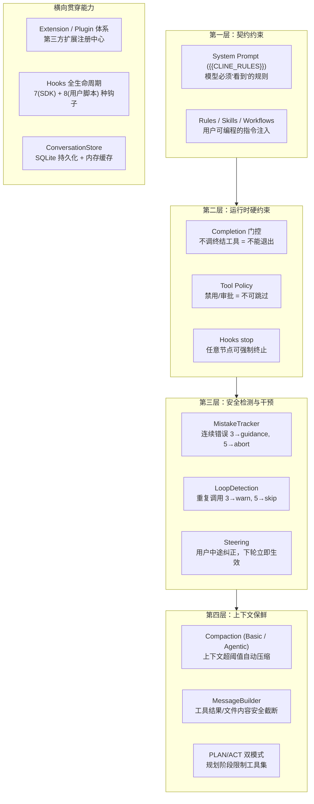

**设计原则：约束分层，由软到硬，逐级兜底。**


> ⚠️ 原文档此处的图片已损坏（缺失），无法导出。

| 层级 | 类型 | 典型机制 | 失败后果 |
| --- | --- | --- | --- |
| 第一层 | 提示词契约 | System Prompt, Rules | 模型可能忽略 |
| 第二层 | 运行时硬约束 | Completion门控, ToolPolicy, Hooks stop | 模型无法绕过 |
| 第三层 | 检测+干预 | MistakeTracker, LoopDetection, Steering | 自动发现并纠正 |
| 第四层 | 上下文保鲜 | Compaction, MessageBuilder | 防止信息过载导致跑偏 |

## 3. 系统提示词与用户消息拼接详解 — SDK 架构下的完整流程

### 3.1 System Prompt — 两套模板

| 模板 | 定义位置 | 用途 |
| --- | --- | --- |
| `DEFAULT_CLINE_SYSTEM_PROMPT` | `shared/src/prompt/system.ts:6` | 正常交互模式 |
| `YOLO_CLINE_SYSTEM_PROMPT` | `shared/src/prompt/system.ts:48` | 自动化/后台模式，强调终结工具 |

### 3.2 占位符注入流程

`buildClineSystemPrompt()` 的执行步骤（伪代码）：

```typescript
function buildClineSystemPrompt(config):
    if overridePrompt 存在:
        return overridePrompt + workspaceMetadata   // subagent 场景

    base = config.mode === "yolo" ? YOLO_PROMPT : DEFAULT_PROMPT

    // 六个占位符替换
    base = base.replace("{{PLATFORM_NAME}}", config.platform)
    base = base.replace("{{CWD}}",          config.workspaceRoot)
    base = base.replace("{{CURRENT_DATE}}", today())
    base = base.replace("{{IDE_NAME}}",     config.ide)
    base = base.replace("{{CLINE_METADATA}}", buildWorkspaceMetadata())
    base = base.replace("{{CLINE_RULES}}",  config.rules)

    // Cline Provider 专属：追加 workspace metadata JSON
    if isClineProvider:
        base += workspaceMetadataBlock

    if config.preferredLanguage:
        base += languageInstruction

    if config.mode === "plan":
        base += PLAN_MODE_INSTRUCTIONS

    return trim(base)
```

### 3.3 Rules 注入的两条路径

```
路径 A：VSCode 扩展端注入（构建阶段）
  VSCode Extension
    → buildUserRules(cwd)
       ├─ 全局 ~/.cline/rules/
       ├─ 本地 .clinerules/
       └─ .agents/AGENTS.md
    → 合并为 rulesContent 字符串
    → buildClineSystemPrompt({ rules: rulesContent })
    → {{CLINE_RULES}} 被替换
路径 B：SDK Extension 运行时注入
  UserInstructionConfigWatcher (FSWatcher)
    → 扫描 .clinerules/, .cline/rules/, .cline/skills/
    → 解析 YAML frontmatter + Markdown
    → UserInstructionConfigService → RuleConfig[]
    → ContributionRegistry.registerRule()
    → SessionRuntime.composeSystemPrompt()
       → mergeSystemPromptRules(base, registeredRules)
```

**两条路径互补**：路径 A 在 Agent 启动时注入（静态），路径 B 运行时 hot-reload（动态）。

### 3.4 最终 System Prompt 结构

```
┌─────────────────────────────────────────────┐
│ [1] 核心 Prompt 模板                         │
│     (占位符已替换为实际值)                    │
├─────────────────────────────────────────────┤
│ [2] Workspace Metadata JSON                 │
│     (git remote, commit hash, branch, hint) │
├─────────────────────────────────────────────┤
│ [3] {{CLINE_RULES}} → 路径 A 规则            │
│     (全局 + 本地 .clinerules/ + AGENTS.md)   │
├─────────────────────────────────────────────┤
│ [4] Preferred Language (可选)               │
├─────────────────────────────────────────────┤
│ [5] PLAN_MODE_INSTRUCTIONS (plan 时)        │
├─────────────────────────────────────────────┤
│ [6] SDK Extension Rules → 路径 B 规则        │
│     ## Rule Name                            │
│     rule instructions...                    │
└─────────────────────────────────────────────┘

关键：
- systemPrompt 是独立字段，不在 messages 数组中
- compaction 只压缩 messages，不碰 systemPrompt
- 每次 run() 重新 composeSystemPrompt()
```

### 3.5 用户消息 XML 格式

```xml
用户输入在发送给 LLM 前被格式化为结构化 XML 标签：
// 普通输入
<user_input mode="act">用户文本</user_input>

// Slash 命令
<user_command slash="/mr">描述...</user_command>

// 文件附件
<file_content path="/abs/path/to/file.ts">文件内容...</file_content>
反向解析：normalizeUserInput() 剥离 XML 标签，还原纯文本。
```

### 3.6 每轮对话发送给 LLM 的完整消息数组结构


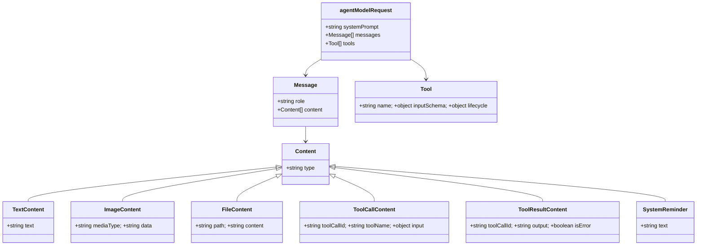

**结构要点**：

1. `systemPrompt` 独立字段，不参与对话历史
2. `tool` role 消息通过 `toolCallId` 与 `assistant` 的 `tool-call` part 配对
3. `[SYSTEM]` 提醒以 `user` role 的 `text` part 形式出现
4. 每轮 assistant 回复可含多个 `tool-call`（支持并行工具调用）
5. Steering 消息以 `user` role 插入到数组末尾

## 4. AgentRuntime — 标准化 Agent 循环与 Completion 门控

### 4.1 核心循环流程图


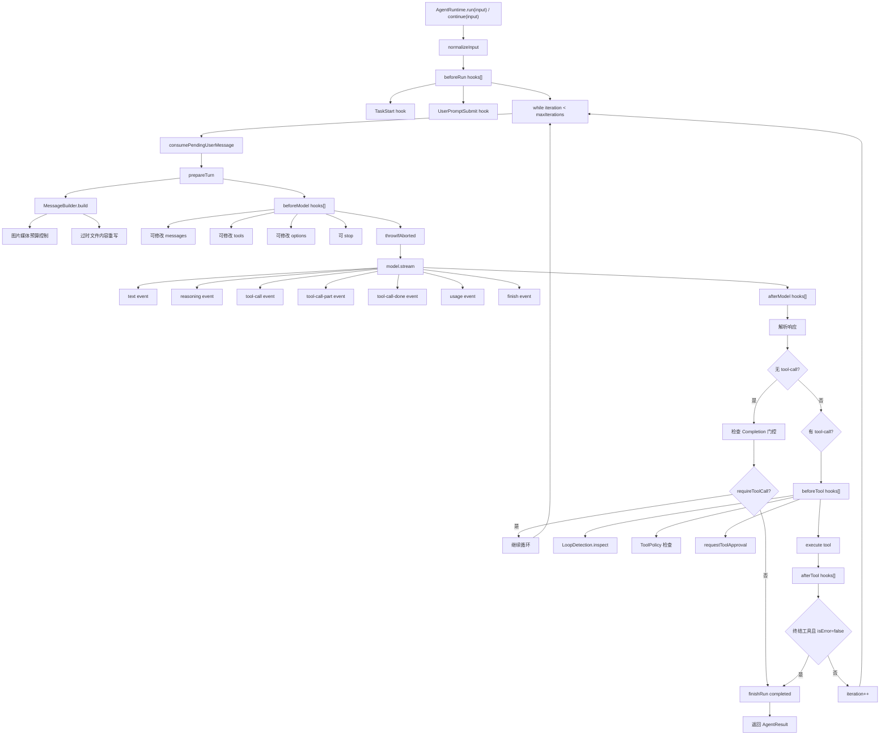

### 4.2 状态机

```
  IDLE ──execute()──→ RUNNING ──finishRun──→ COMPLETED
                        │    │
                        │    ├── abort() ──→ ABORTED
                        │    ├── hook stop → ABORTED
                        │    └── maxIter/异常 → FAILED
                        │
                   restore() → abort + 重置 → IDLE
```

### 4.3 Completion 门控 — 三层决策树

**核心问题**：LLM 可能“暗自退出”——直接返回总结文本就结束，没真正完成任务。

**解决方案**：模型必须显式调用 `completesRun=true` 的终结工具（如 `attempt_completion`、`submit_and_exit`）才能退出。

```
模型返回响应
    │
    ▼
响应中有 tool-call？
    │
    ├─【否】→ 无 tool-call 分支
    │         ▼
    │   层一: requireCompletionTool?
    │     是 → 注入 "[SYSTEM] 必须调用 submit_and_exit..."
    │   层二: completionGuard 回调?
    │     返回非空 → 注入自定义提醒
    │   两层均不拦截 → finishRun(completed)
    │
    └─【是】→ 有 tool-call 分支
              ▼
         executeToolCalls()
              ▼
         层三: 终结工具成功 + isError=false?
           是 → finishRun(completed)
           否 → continue
```


| 层级 | 配置项 | 拦截条件 | 效果 |
| --- | --- | --- | --- |
| 层一 | `requireCompletionTool=true` | 存在 `completesRun=true` 的工具 | `[SYSTEM]` 提醒必须调用哪些终结工具 |
| 层二 | `completionGuard` 回调 | 回调返回非空字符串 | 业务自定义守卫（如 TeamAgent） |
| 层三 | `lifecycle.completesRun=true` | 终结工具成功 + 无错误 | 只有终结工具的成功执行才允许退出 |

### 4.4 Iteration 硬上限与 Abort

| 机制 | 配置 | 说明 |
| --- | --- | --- |
| 硬上限 | `maxIterations` (默认 50) | 超出抛异常 → status=failed |
| Abort 检查点 | 4 个位置 | turn 起始 / stream 每事件 / hook stop / stream 结束后 |
| 受控停止 | `ControlledStopError` | hook 返回 `{ stop: true }` → 分类为 aborted (非 failed) |

### 4.5 restore() — 对话重置

```
restore(messages):
  ① abort("Agent state restored")
  ② 重置状态 → idle
  ③ 保留: model, tools, hooks, plugins, listeners
  ④ state.messages = cloneMessages(messages)
```

### 4.6 流式事件 — 单轮事件序列

```
run-started
┌─ iteration N ────────────────────────────────────────────────┐
│ turn-started                                                 │
│ assistant-text-delta      × N    (流式文本)                   │
│ assistant-reasoning-delta  × M   (流式推理)                   │
│ usage-updated              × K   (token 使用量)               │
│ message-added                     (assistant message)        │
│ assistant-message                 (含 finishReason)          │
│ ┌─ 有 tool calls: ──────────────────────────────────────┐    │
│ │ tool-started      × T                                 │    │
│ │ tool-updated      × ?    (可选，实时进度)              │    │
│ │ tool-finished     × T                                 │    │
│ │ message-added     × T    (tool result)                │    │
│ └───────────────────────────────────────────────────────┘    │
│ turn-finished                                                │
└──────────────────────────────────────────────────────────────┘
run-finished / run-failed       ← run 结束后
status-notice                   ← prepareTurn 中 (可选)
messages-truncated              ← 截断发生时
compaction                      ← 压缩发生时
```

## 5. 消息管理：对话生命周期与消息传递管道

**消息管理**是 Harness 的“血液循环系统”——它决定 Agent 看到什么、记住什么、忘记什么。从 `ConversationStore` 的内存管理到 `MessageBuilder` 的 API 安全截断，再到 `consumePendingUserMessage` 的 Steering 注入，这一整套消息生命周期是 Agent 不跑偏的数据基础。

### 消息存储三层架构


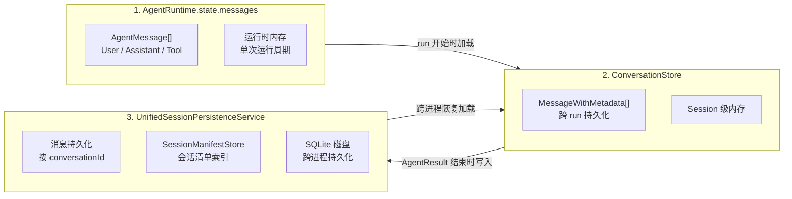

### 核心生命周期


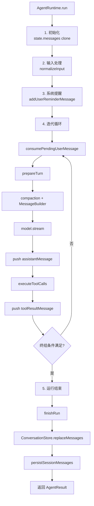

### 5.3 ConversationStore — 跨 Run 的内存持久化

```
// session/stores/conversation-store.ts (~120行)
class ConversationStore {
    private messages: MessageWithMetadata[] = [];
    private conversationId = createConversationId();
    private sessionStarted = false;

    getMessages(): MessageWithMetadata[]      // 返回副本
    appendMessage(message): void               // 单条追加
    appendMessages(messages): void             // 批量追加
    replaceMessages(messages): void            // 整体替换
    resetForRun(): void                        // 清空 + 新 conversationId
    clearHistory(): void                       // 同上
    restore(messages): void                    // 从持久化恢复
    isSessionStarted(): boolean                // 首次 run 门控
    markSessionStarted(): void
}
```

**关键设计**： - `SessionRuntime` 持有一个 `ConversationStore` 实例，生存周期 = 整个 session - 每次 `run()` 启动新的 `AgentRuntime`，但 `ConversationStore` 不变 - `sessionStarted` 用于触发 `session_start` hooks（仅首次 run） - `getMessages()` 返回**副本**，防止外部意外修改

### 5.4 MessageBuilder — 每轮 API 调用的安全处理

`MessageBuilder`（`session/services/message-builder.ts`, ~1727行）由 `SessionRuntime` 持有，通过 `prepareTurn` 在每次 LLM 调用前执行。它不是 AgentRuntime 的一部分，而是 Session 级别的 Provider 消息准备器。

```
buildForApi(messages: Message[]): Message[]
  │
  ├─ ① reindex(messages) — 增量重建工具调用索引
  │     ├─ toolName → 最近读取位置 → 文件 owner
  │     └─ 检测 write_to_file 导致的 read_file 过期
  │
  ├─ ② commitOutdatedRewrites(messages) — 标记过期文件
  │     后续 write_to_file 修改了文件 → 之前的 read_file 结果被替换
  │     → "[outdated - see the latest file content]"
  │     批量触发: 累计 ≥ 65536 bytes 过期内容才执行
  │
  ├─ ③ addMissingToolResults(messages) — 修复缺失的工具结果
  │     为没有 tool_result 的 tool_use 补充错误占位
  │
  ├─ ④ 逐条 transform — 内容安全截断:
  │     tool_result  → truncateToolResultContent(默认 8000 chars)
  │     file block   → truncateMiddleByChars(默认 50000 chars)
  │     user text    → normalizeUserInput (剥离 XML 标签)
  │     assistant    → truncateAssistantText(常规 200K / markup 12K)
  │
  ├─ ⑤ applyMediaBudget() — 图片媒体预算管理
  │
  └─ ⑥ truncateToTotalTextBudget() — 总文本预算 (默认 6MB)
```

### 5.5 Steering 注入 — consumePendingUserMessage

Steering 是用户在 Agent 执行过程中“中途纠正”的机制。通过 `consumePendingUserMessage` 回调在 Agent 循环中消费：

```
// agent-runtime.ts:1092-1109
consumePendingUserMessage():
  ├─ 检查 config.consumePendingUserMessage 是否存在
  ├─ 调用 → 获取 pending 文本
  └─ 创建 user message → state.messages.push → emit "message-added"
```

**调用时机**（agent-runtime.ts:800-803）：

```
generateAssistantMessage():
  if (state.iteration > 1) {              ← 第一轮不消费！
      consumePendingUserMessage()          ← 每轮消费一次
      → request.messages 刷新
  }
```

**关键设计**： - **第一轮不消费**：`iteration > 1` 确保初始输入不被覆盖 - **每轮消费一次**：每次 `generateAssistantMessage()` 只取一个 - **Teams 有专用实现**：TeamAgent 从 `member.pendingSteerMessage` 读取

### 5.6 消息编解码 — AgentMessage ↔ Message

```
内部: AgentMessage (AgentRuntime.state.messages)
  │ agentMessagesToMessagesWithMetadata()  → ConversationStore
  │ agentMessagesToMessages()              → MessageBuilder
  │
  │ messagesToAgentMessages()              ← ConversationStore → AgentRuntime
```

### 5.7 消息管理在防跑偏中的角色

- **防止基于过时信息决策**：`commitOutdatedRewrites` 标记过期文件 → Agent 不会基于旧内容做决策
- **防止上下文过载**：MessageBuilder 截断 + Compaction → 保持在有效注意力窗口内
- **用户中途纠正不丢失**：`consumePendingUserMessage` 每轮消费 → Steering 在下轮立即生效

## 6. Tool 协议与 Tool Policy — 行动硬约束

### 6.1 工具集合构建

工具在 `runtime-builder.ts:buildTools()` 中按优先级组装：

```
buildTools(config):
  1. 内置核心工具: read_file, write_to_file, execute_command, ...
  2. Providers 工具: 各 LLM provider 注册的工具
  3. MCP 工具:      通过 MCP protocol 发现的远程工具
  4. Skills 工具:   createSkillsTool() 注册
  5. Team 工具:     spawn_agent, ask_question (enableAgentTeams=true)
  6. Plan 模式工具:  switch_to_act_mode (enablePlanAct=true)
  7. Plugin 工具:   ExtensionRegistry 注册的外部工具
```

### 6.2 Tool Policy 约束规则

```
// 伪代码
ToolPolicy {
  enabled?: boolean              // false → 工具不可用
  autoApprove?: boolean          // false → 需要审批
  approvalMode?: "always" | "never" | "oncePerSession"
}

toolPolicies: {
  "*":               { autoApprove: false },   // 全局默认：需要审批
  "read_file":       { autoApprove: true },    // 只读工具：自动批准
  "execute_command": { autoApprove: false },   // 危险工具：必须审批
}
```

**执行流程**：`beforeTool` hook → 检查 policy → `enabled=false` → skip → 返回 skip 消息给 LLM → 继续循环

### 6.3 审批流程

```
AgentRuntime → requestToolApproval(toolCall)
  → 桌面通知 "Allow execute_command with: npm install?"
  → 用户 Allow / Deny
  → 返回 { approved: boolean }
```

### 6.4 各工具用法限制速查

每个工具在**输入层**（Schema 校验 / executor 内部）有限制，在执行完成后又会被 **MessageBuilder**（每轮必定执行）二次截断。下面汇总两层限制。

#### 6.4.1 工具输入与输出限制

| 工具名 | 输入限制 | 输出限制（Executor 层） | 超时 | 可重试 | 特殊说明 |
| --- | --- | --- | --- | --- | --- |
| `read_files` | 路径必填，可选 `start_line`/`end_line` | ≤ 2,000 行 / ≤ 48,000 字符 / 单行 ≤ 2,000 字符 | 10,000ms (多文件×2) | 1 次 | 大文件/二进制不支持；超出后 middle-truncated |
| `search_codebase` | `queries` 正则数组 | ≤ 48,000 字符 / 查询 | 30,000ms (并行×2) | 1 次 | 超出后 middle-truncated；`queries` 无长度硬限制 |
| `editor` | `new_text` 和 `old_text` 各 **≤ 6,000 字符** | — | 30,000ms | **不可重试** | 超过 6,000 直接报错（不写入磁盘）；`editor` / `apply_patch` 二选一 |
| `apply_patch` | `input` 字符串（patch 内容） | — | 30,000ms | **不可重试** | 与 `editor` 互斥；无字符硬限制但受超时约束 |
| `run_commands` | 单命令字符串 ≤ 12,000 字符 | ≤ 48,000 字符 | 30,000ms (并行×2) | **不可重试** | 必须非交互；heredoc 自动合并；超出后 middle-truncated |
| `fetch_web_content` | `url` + `prompt`(≥2字符) | — | 30,000ms (并行×2) | 2 次 | 无输出硬限制 |
| `skills` | `skill` 必填, `args` 可选 | — | 15,000ms | **不可重试** | — |
| `ask_question` | 2-5 个选项 + `question` | — | 无 | **不可重试** | 无超时 |
| `submit_and_exit` | `summary` ≥ 10 字符 | — | 15,000ms | **不可重试** | `completesRun: true` |

#### 6.4.2 MessageBuilder 层二次截断（每轮必定执行，无条件）

```
MessageBuilder.buildForApi() 逐条 transform:

  tool_result 块 → truncateMiddle(maxToolResultChars = 8,000)
  file 块       → truncateMiddle(maxFileContentChars = 50,000)
  assistant 文本 → truncateMiddle(maxAssistantTextChars = 200,000)
  assistant 含工具标记 → truncateMiddle(maxAssistantToolMarkupChars = 12,000)

  总文本预算     → enforceBudget(maxTotalTextBytes = 6,000,000)
                   → 超出则逐条字节级截断 "...[truncated N chars to fit provider request budget]..."
```

#### 6.4.3 环境变量覆盖

| 常量 | 默认值 | 环境变量 |
| --- | --- | --- |
| `maxToolResultChars` | 8,000 | `CLINE_MESSAGE_BUILDER_MAX_TOOL_RESULT_CHARS` |
| `maxTotalTextBytes` | 6,000,000 | `CLINE_MESSAGE_BUILDER_MAX_TOTAL_TEXT_BYTES` |

#### 6.4.4 实际示例：write_to_file 大文件的两层限制

```
写 15,000 字符的文件:
  → 步骤1: editor 检查 new_text(15000) > INPUT_ARG_CHAR_LIMIT(6000) → ❌ 报错，不执行
写 5,000 字符的文件:
  → 步骤2: 通过检查 → ✅ 完整写入磁盘
  → 步骤3: 工具结果 = "File written: 5000 chars" → MessageBuilder 不截断（≤8000）
写 5,000 字符后，read_file 回读 48000 字符:
  → 步骤4: read_files executor 截断到 48000
  → 步骤5: MessageBuilder 把 read_files 结果中的 file 块 截断到 50,000（不触发）
```

## 7. Hooks

**⚠️ 关键区分**：项目中存在两套 Hooks 体系，处于不同抽象层次，服务不同人群。理解它们的关系是理解整个 Harness 可扩展性的基础。

### 7.1 两套体系对比


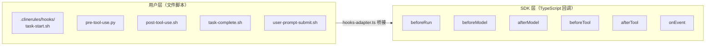

### 7.2 体系 A：SDK 运行时 Hooks（7 种）

定义在 `sdk/packages/shared/src/agent.ts`，`AgentRuntimeHooks` 接口。遵循 **Chain of Responsibility** 模式：任一 hook 返回 `{ stop: true }` 即终止。

| Hook | 触发时机 | 可 stop? | 可修改? | 用途 |
| --- | --- | --- | --- | --- |
| `beforeRun` | run 开始前 | ✅ | ❌ | 前置条件校验 |
| `afterRun` | run 结束后 | ❌ | ❌ | 日志、清理 |
| `beforeModel` | 每次 LLM 调用前 | ✅ | ✅ messages/tools | 安全策略注入、Steering 消费 |
| `afterModel` | 每次 LLM 返回后 | ✅ | ❌ | 质量检查 |
| `beforeTool` | 每个工具执行前 | ✅ | ✅ skip / 改 input | ToolPolicy 检查、参数校验 |
| `afterTool` | 每个工具执行后 | ✅ | ✅ 改 result | 结果校验、错误追踪 |
| `onEvent` | 任意事件发生时 | ❌ | ❌ | 遥测、日志、外部监听 |

**在 AgentRuntime 循环中的挂载位置**：

```
run()
  ├── beforeRun hooks[]          ← 前置检查
  └── for each turn:
        ├── beforeModel hooks[]  ← 可改 messages/tools
        ├── model.stream()
        ├── afterModel hooks[]   ← 可 stop
        └── for each toolCall:
              ├── beforeTool hooks[]  ← 可 skip / 改 input
              ├── execute tool
              └── afterTool hooks[]   ← 可改 result / stop
```

### 7.3 体系 B：用户文件脚本 Hooks（8 种）

用户可在 `.clinerules/hooks/` 下放置可执行脚本。HookFactory 发现并通过 `hooks-adapter.ts` 桥接到 SDK Hooks。

| 用户 Hook 名称 | → 桥接到 SDK Hook | 触发时机 | 状态 |
| --- | --- | --- | --- |
| `TaskStart` | → `beforeRun` | 新任务开始 | ✅ |
| `UserPromptSubmit` | → `beforeRun` | 用户提交输入 | ✅ |
| `PreToolUse` | → `beforeTool` | 工具执行前 | ✅ |
| `PostToolUse` | → `afterTool` | 工具执行后 | ✅ |
| `TaskComplete` | → `afterRun` | 任务完成 | ✅ |
| `TaskCancel` | → `afterRun` | 任务取消 | ✅ |
| `TaskResume` | → 未映射 | 任务恢复 | ⏳ |
| `PreCompact` | → 未映射 | 上下文压缩前 | ⏳ |

**文件钩子输出协议**（stdout JSON）：

```json
{
  "cancel": false,
  "contextModification": "注入到上下文的额外内容",
  "errorMessage": "停止原因（cancel=true 时）"
}
```

### 7.4 Hooks 合并策略

`session-runtime-orchestrator.ts` 合并三个来源的 hooks：

```
来源 1: AgentConfig.hooks           ← 用户通过 createSession 传入
来源 2: Extension hooks             ← Plugin 通过 ContributionRegistry 注册
来源 3: 内部安全检查 hooks           ← MistakeTracker, LoopDetection, ToolPolicy

合并策略（伪代码）:
mergedHooks = {
  beforeRun:   [...configHooks, ...extensionHooks],
  beforeModel: [...internalSafety, ...configHooks, ...extensionHooks],
  beforeTool:  [...toolPolicy, ...loopDetection, ...configHooks, ...extensionHooks],
  afterTool:   [...mistakeTracker, ...configHooks, ...extensionHooks],
}
```

**关键设计**：内部安全检查排在数组最前面，用户/扩展 hooks 无法绕过它们。

### 7.5 Hooks 在防跑偏中的角色

```
场景分类:

1. 阻止危险操作:
   beforeTool → ToolPolicy 检查 → enabled=false → skip

2. 检测异常模式:
   afterTool → MistakeTracker 计数 → count>=5 → abort

3. 防止循环:
   beforeTool → LoopDetection 检查 → 重复→skip

4. 用户自定义审计:
   PostToolUse 脚本 → 检查工具输出 → 不符合预期 → cancel
```

## 8. 安全护栏：MistakeTracker + LoopDetection

两个独立的安全子系统，均通过 `beforeTool` / `afterTool` hooks 挂载。

### 8.1 协作关系图


```
                    ┌──────────────┐
                    │  工具执行     │
                    └──────┬───────┘
                           │
              ┌────────────┼────────────┐
              ▼            ▼            ▼
     ┌────────────┐ ┌────────────┐ ┌──────────┐
     │ beforeTool │ │  execute   │ │ afterTool│
     │ Hook检查   │ │            │ │ Hook检查 │
     └─────┬──────┘ └────────────┘ └────┬─────┘
           │                            │
     ┌─────┴───────┐             ┌──────┴───────┐
     │LoopDetection│             │MistakeTracker│
     │重复?→skip   │             │失败?→count++  │
     └─────────────┘             └──────────────┘
```

### 8.2 MistakeTracker 工作原理

```
状态机:
  count = 0           ← 初始 / 每次成功后重置
  工具调用失败 (抛异常 / isError=true):
    count++
    count >= 3:
      → 注入 guidance: "[SYSTEM] You've encountered multiple consecutive errors..."
      → 建议 Agent 重新评估策略
    count >= 5:
      → abort("Consecutive mistake limit reached")
      → run 状态 → "failed"
  特殊处理:
    ask_question 工具不作为错误计数 (允许用户自然交互)
```


### 8.3 LoopDetectionTracker 工作原理

```


检测规则:
  1. hash = sha256(toolName + JSON.stringify(parameters))
  2. 滑动窗口: 最近 10 个工具调用
  3. 窗口内最大允许重复: 3 次
  分级处理:
    出现 3 次相同 hash → SOFT 警告
      → 注入 "[SYSTEM] You appear to be repeating the same action..."
    出现 5 次相同 hash → HARD 拒绝
      → 跳过该工具调用 + 返回 skip 消息给模型
  resetOnSuccess:
    新的不同工具调用成功 → 重置计数器

```

### 8.4 防跑偏联动表

| 场景 | MistakeTracker | LoopDetection | 结果 |
| --- | --- | --- | --- |
| 工具报错 3 次 | guidance 注入 | - | Agent 被提醒重新评估 |
| 工具报错 5 次 | **abort** | - | run 强制结束 |
| 重复相同调用 3 次 | - | SOFT 警告 | `[SYSTEM]` 提醒 |
| 重复相同调用 5 次 | - | **HARD skip** | 工具被跳过 + skipReason |
| 报错+重复同时发生 | count++ | hash 累积 | 两套机制同时生效 |

### 8.5 防线之间的协作示例

**场景：Agent 生成了错误的 **`execute_command`**，反复用不同参数重试**

```
轮次 1: execute_command("rm -rf /wrong/path") → 失败
         → MistakeTracker count=1

轮次 2: execute_command("rm -rf /wrong/path2") → 失败
         → count=2
         → LoopDetection: 检测到 execute_command 重复

轮次 3: execute_command("rm -rf /wrong/path3") → 失败
         → count=3 → 注入 guidance: "[SYSTEM] multiple consecutive errors..."
         → LoopDetection: repeat count=3 → SOFT: "[SYSTEM] repeating the same action..."

轮次 4: 仍然 execute_command → 失败
         → count=4, LoopDetection repeat count=4

轮次 5: 再次 execute_command → 失败
         → count=5 → abort("Consecutive mistake limit reached")
         → run 状态 → "failed"
```

**用户中途纠正介入**：

```
轮次 2 失败后:
  用户输入: "停止，不要用 rm，应该用 mv"
  下一轮 beforeModel 前: consumePendingUserMessage()
  → 新 user message 注入 → LLM 收到纠正
  → Agent 行为转向正确方向
```


## 9. FocusChain / task_progress 的取消与替代

### 9.1 旧架构中 FocusChain 的作用

旧架构中 `focus-chain/` 提供了任务计划锁（`task_progress` 工具），要求 Agent 在每一步操作后更新 `task_progress`，形成“计划 → 执行 → 报告进度”的循环。这种强行注入 XML 块到对话历史的做法，在新架构中被**全部取消**。

### 9.2 新架构的替代方案

| 旧机制 | 新替代 | 为什么更好 |
| --- | --- | --- |
| `task_progress` 工具 | Completion 门控 + Hooks | 不污染对话历史，运行时硬约束 |

## 10. 上下文保鲜：Compaction Pipeline + MessageBuilder

**上下文保鲜**是防止 Agent 跑偏的隐性防线。当上下文过长时，模型注意力稀释，更容易遗忘 System Prompt 中的规则。Compaction 和 MessageBuilder 共同确保上下文始终在可处理的范围内。

**关键理解**：Compaction 和 MessageBuilder 是**两个独立机制、各自有不同的触发条件、使用不同的截断标记**。大部分用户遇到的“截断”现象来自 MessageBuilder（而非 Compaction）。

### 10.1 两层机制的角色区分

```
① Compaction Pipeline (按需触发)                                 
   触发条件: token 占用率超过阈值                                  
   作用: 删除/压缩旧的对话轮次                                     
   标记: "...[truncated N chars]" (压缩前预截断)                                                               
② MessageBuilder.buildForApi() (每轮必定执行)                     
   触发条件: 无条件，每次 API 调用前都运行                         
   作用: 截断单个工具结果、总文本预算、过时文件标记、媒体预算       
   标记:                                                         
     - "...[truncated N chars]" (单结果截断, TRUNCATE_MARKER_DEFAULT)
     - "...[truncated N chars to fit provider request budget]..."
       (总预算截断, TRUNCATE_MARKER_BUDGET)                      
     - "[outdated - see the latest file content]" (过时文件)     
```

**两套截断标记的含义不同**： 

看到 `...[truncated N chars]...` → MessageBuilder 的单结果截断（默认 8000 字符），或 Compaction 预截断（2000 字符）

看到 `...[truncated N chars to fit provider request budget]...` → MessageBuilder 的总文本预算截断（默认 6MB） 

看到 `[outdated - see the latest file content]` → 后续的 write_to_file 使之前的 read_file 结果过期

### 10.2 Compaction Pipeline — 详细触发条件与策略选择

Compaction 由 `createContextCompactionPrepareTurn()` 创建。

**前置条件**：`compaction.enabled` 必须为 `true`，否则整个 Pipeline 不执行。

#### 10.2.1 触发阈值计算

```
resolveTriggerState() 的决策逻辑:

1. 如果配置了 reserveTokens:
   triggerTokens = maxInputTokens - reserveTokens
   例: maxInputTokens=128000, reserveTokens=8000
       → triggerTokens=120000, 超过即触发

2. 如果配置了 thresholdRatio:
   triggerTokens = maxInputTokens * thresholdRatio
   例: maxInputTokens=128000, thresholdRatio=0.9
       → triggerTokens=115200, 超过即触发

3. 都没配置 (默认):
   triggerTokens = min(maxInputTokens - DEFAULT_RESERVE_TOKENS,
                       maxInputTokens * DEFAULT_THRESHOLD_RATIO)
   即取两者中更保守的值
```

#### 10.2.2 三种压缩策略的选择

```
utilization > 阈值 → 进入策略选择:
├── 自定义压缩 (compaction.compact 函数存在)
│     → 完全由用户提供的函数处理
│
├── Agentic Compaction (compaction.strategy === "agentic")
│     条件: summarizer 模型配置存在
│     → 用 LLM 生成结构化总结替代旧消息
│
└── Basic Compaction (默认, compaction.strategy === "basic")
     → Token 预算驱动的逐级截断
```

#### 10.2.3 压缩目标 Token 计算

```
Basic Compaction 的 targetTokens 由两个因素决定:

1. 对话长度 ≤ 4 轮 (messagePairCount < 5):
   targetTokens = triggerTokens * DEFAULT_TARGET_RATIO(0.7)

2. 对话长度 ≥ 5 轮 + modelMaxTokens < maxInputTokens:
   targetTokens = maxInputTokens * 0.5  // LONG_CONVERSATION_TARGET_RATIO
   即长对话更激进地压缩，直接降到 50%

手动压缩模式:
   targetRatio 默认 0.5, 且不低于 auto 的 thresholdRatio
```

#### 10.2.4 具体触发示例

```
示例 1: Claude 模型, maxInputTokens=200000, 默认配置
  triggerTokens = min(200000-8000, 200000*0.9) = min(192000, 180000) = 180000
  即 token 使用超过 180000 (90%) 时触发 Basic Compaction

示例 2: 对话已进行 6 轮，每次 write_to_file 产生 ~5000 token 的结果
  累计 tokens ≈ 6 * (model输出 ~2000 + 工具结果 ~5000) ≈ 42000
  远未到触发阈值 → 不压缩

示例 3: 对话进行 30 轮后触发了压缩
  messagePairCount=30 ≥ 5, modelMaxTokens 通常 < maxInputTokens
  → targetTokens = maxInputTokens * 0.5 = 100000
  即压缩到上下文窗口的 50%

示例 4: Compaction 被禁用 (compaction.enabled = false)
  → 整个 Pipeline 跳过，不会发生任何压缩
  → 但 MessageBuilder 仍然执行！


```

### 10.3 Basic Compaction — 五级截断详解

Basic Compaction 是默认策略，采用**原子移除**机制：`tool_use` 和对应的 `tool_result` 通过 `toolPairIds` 关联，移除时保证成对移除，不会产生孤立的工具结果。


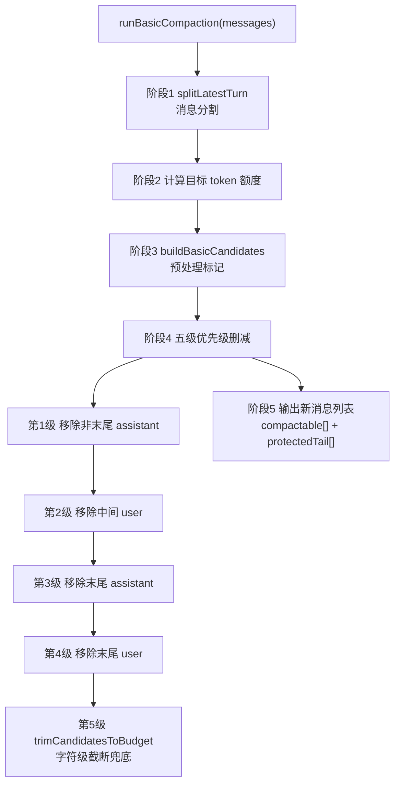

**关键保护项**： - `isFirstUser`（第一条 user 消息）在第1-4级移除中保留，第5级尽力保留，绝对必要时才截断 - `protectedTail`（最近一轮对话）完全不受压缩影响 - 原子移除保证 `tool_use` 和 `tool_result` 同步移除，不会出现孤立的工具结果

### 10.4 Agentic Compaction — LLM 语义总结

当配置 `compaction.strategy = "agentic"` 且有 `summarizer` 模型时，使用此策略。

runAgenticCompaction() 执行流程:

① findCutIndex(messages, preserveRecentTokens)

   找到从哪条消息开始保留（保留最近 ~preserveRecentTokens 的 token）

② 提取上下文:

   previousSummary = 上一轮的 compaction summary (如果有)

   fileOps = 从消息中提取的文件操作记录

③ buildSummaryRequest():

   构建包含以下内容的 prompt:

   - ## Goal: 当前任务目标

   - ## State: 完成/进行中/阻塞

   - ## Highlights: 关键决策和发现

   - ## Next: 下一步计划

   - ## Files: 涉及的文件及修改状态

④ generateSummary() 调用 summarizer LLM:

   maxOutputTokens = 1024, 禁用 thinking

   生成结构化 continuation note

⑤ 重组消息:

   newMessages = [summaryMessage, ...保留尾部消息]触发条件：compaction.strategy === "agentic" + compaction.summarizer 配置存在。

**对比 Basic Compaction**：Agentic 理解语义、能保留关键决策，但消耗额外的 LLM 调用成本。Basic 纯粹基于 token 计数，速度快但可能丢失语义上重要的内容。


### 10.5 MessageBuilder — 为何大段写入被截断

**这是用户最常遇到的问题**：用 `write_to_file` 写入大文件时，模型的反馈显示 `...[truncated N chars]...`。这不是 Compaction，而是 **MessageBuilder 默认 8000 字符的工具结果截断**。

#### 10.5.1 截断发生的完整链路

```
Agent 调用 write_to_file (写入 15000 字符的文件)
  │
  ▼
工具执行器将完整内容写入磁盘 (文件实际是完整的！)
  │
  ▼
工具返回结果: "File created successfully at: /path/to/file.ts"
或者返回完整文件内容的确认信息
  │
  ▼
AgentRuntime 将结果存为 tool_result 消息
  │
  ▼
下一轮 prepareTurn() → MessageBuilder.buildForApi():
  │
  ├─→ transformBlock() 处理每个 block:
  │     block.type === "tool_result"?
  │       是 → truncateToolResultContent()
  │         → truncateMiddle(content, maxToolResultChars=DEFAULT_8000)
  │         → 15000 字符 > 8000 字符 → 截断！
  │         → 返回 "...[truncated 7000 chars]..."
  │
  ├─→ truncateToTotalTextBudget()
  │     总文本 > 6MB? → 二次截断
  │
  └─→ 返回截断后的消息数组
```

#### 10.5.2 为什么是 8000 字符

```
// message-builder.ts 源码逻辑:
DEFAULT_MAX_TOOL_RESULT_CHARS = 8_000

truncateMiddleByChars(text, 8000, TRUNCATE_MARKER_DEFAULT):
  if text.length <= 8000: return text   // 不截断
  // 否则保留前后各约 4000 字符 (减去标记长度)
  // 中间插入 "...[truncated N chars]..."
```

**设计意图**：单条工具结果过长会挤出 System Prompt 在上下文中的注意力。8000 字符是经验值——足以保留关键信息，同时防止工具结果“淹没”规则指令。

#### 10.5.3 总文本预算截断（6MB 默认）

```
truncateToTotalTextBudget() 是第二层保护:

总文本 > 6MB → 启动候选收集:
  - 工具结果文本 (保留至少 2000 bytes)
  - Assistant 文本 (保留至少 40000 bytes)
  - Tool call 参数 (最后手段)

截断标记不同: "...[truncated N chars to fit provider request budget]..."

所以看到 "to fit provider request budget" = 总预算截断
看到没有这句 = 单结果截断
```

#### 10.5.4 如何解决大段写入被截断

```bash
方案 1: 环境变量 (推荐)
  export CLINE_MESSAGE_BUILDER_MAX_TOOL_RESULT_CHARS=32000
  将单结果截断阈值提高到 32000 字符

方案 2: 拆分写入
  让模型用 replace_in_file 分多次修改，每次修改片段 < 8000 字符

方案 3: 接受截断
  截断只影响"模型看到的上下文"，不影响实际写入磁盘的内容
  文件是完整写入的，模型只是看不到完整的写入确认信息
```

### 10.6 MessageBuilder 完整处理流程

`buildForApi()` 在每次 API 调用前执行，按以下顺序处理：

### 10.7 截断参数汇总与调优


```mermaid
flowchart TD
    A[buildForApi(messages)] --> B[reindex]
    B --> C[commitOutdatedRewrites]
    C --> D[addMissingToolResults]
    D --> E[逐条 transform]
    E --> E1["tool_result<br/>truncate 8000 字符"]
    E --> E2["file block<br/>truncateMiddleByChars 50000 字符"]
    E --> E3["user text<br/>normalizeUserInput"]
    E --> E4["assistant text<br/>truncate 200000 / 12000"]
    E --> F[applyMediaBudget]
    F --> G[truncateToTotalTextBudget 6MB]
```

| 参数 | 默认值 | 环境变量 | 影响 |
| --- | --- | --- | --- |
| 单工具结果截断 | 8,000 chars | `CLINE_MESSAGE_BUILDER_MAX_TOOL_RESULT_CHARS` | **write_to_file / read_file 结果的最大可见长度** |
| 文件附件截断 | 50,000 chars | - | 用户上传的文件附件 |
| 总文本预算 | 6,000,000 bytes | `CLINE_MESSAGE_BUILDER_MAX_TOTAL_TEXT_BYTES` | 整次请求的文本上限 |
| Assistant 文本 | 200,000 chars | - | 模型回答的文本部分 |
| Tool-call markup | 12,000 chars | - | 模型生成工具调用的 XML markup |
| 过期文件标记阈值 | 65,536 bytes | `CLINE_MESSAGE_BUILDER_MIN_OUTDATED_REWRITE_BYTES` | 批量标记的触发量 |

### 10.8 压缩参数

| 参数 | 默认值 | 说明 |
| --- | --- | --- |
| `compaction.enabled` | `true`? | 必须为 true，否则整个 Pipeline 不执行 |
| `thresholdRatio` | 0.9 | 超过此比例触发压缩 |
| `targetRatio` | 0.7 | 压缩目标比例（长对话降至 0.5） |
| `compaction.strategy` | `"basic"` | 可选 `"basic"` / `"agentic"` |
| `maxCompactionIterations` | 3 | 单次最大压缩轮次 |
| summarizer `maxOutputTokens` | 1024 | Agentic 总结输出上限 |
| tool result 预截断 (Basic) | 2000 chars | 压缩前的预截断 |
| `DEFAULT_RESERVE_TOKENS` | ~8000 | 默认预留空间 |

### 10.9 上下文保鲜对防跑偏的价值

- **防止注意力稀释**：上下文过长 → 模型遗忘 System Prompt 中的 Rules → 跑偏。Compaction 和 MessageBuilder 共同将上下文维持在模型的有效注意力窗口内
- **防止基于过时信息决策**：文件被后续 `write_to_file` 修改 → 之前的 `read_file` 结果被自动标记为 `[outdated]` → 模型不会基于旧内容做决策
- **大段写入被截断 ≠ 文件损坏**：MessageBuilder 截断只影响对话历史中模型看到的工具结果，实际写入磁盘的文件是完整内容
- **环境变量可调优**：不同 Provider 有不同的上下文窗口，可通过环境变量按需微调截断参数

## 11. 用户可编程控制层：Rules / Skills / Workflows

### 11.1 架构总览


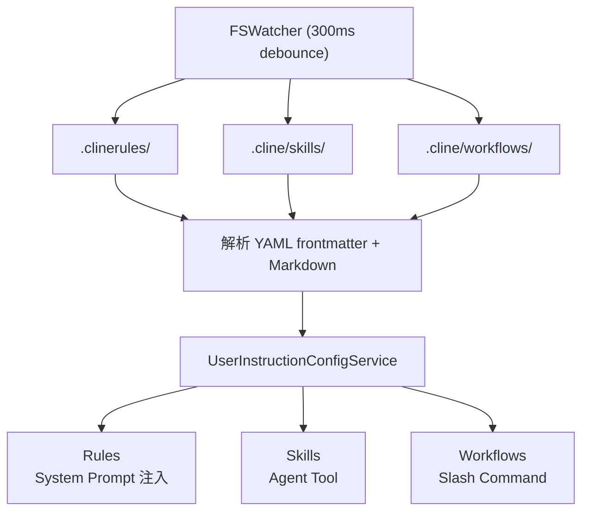

### 11.2 规则目录结构

```
<workspace>/.clinerules/      ← 工作区规则 (Git 追踪)
~/.clinerules/                ← 用户全局规则
<workspace>/.cline/rules/     ← Cline 管理的规则
<workspace>/.agents/AGENTS.md  ← 工作区 Agent 说明
```

### 11.3 规则格式

```
---
disabled: false
---
# Rule Name
规则正文 - markdown 格式
```

- `disabled: true` → 不加载
- 渲染格式：`## Rule Name\n{content}\n\n`，多条规则用 `\n\n` 分隔

### 11.4 Hot-Reload 机制

```
文件保存 .clinerules/rule.md
  → FSWatcher 检测变化 (300ms debounce)
  → 重新解析 YAML+Markdown
  → RuleConfig[] 更新
  → 下次 prepareTurn: formatRulesForSystemPrompt(RuleConfig[])
  → 注入 System Prompt

关键特性:
  - 无需重启 Agent
  - 下一轮对话立即生效
  - 支持新增/修改/删除
```

### 11.5 Skill 系统

- 文件结构：`.cline/skills/<name>/SKILL.md`
- 格式：YAML frontmatter (`description`, `disabled`) + Markdown 指令
- 触发方式：Agent 通过 `skills` 工具主动调用
- 防重入：同一 skill 不允许并发执行，`pendingSkills` 队列跟踪

### 11.6 Workflow 系统

- 与 Skill 结构类似，但通过 Slash Command 触发（`/workflow-name`）
- Agent 不会主动调用 workflow
- 解析为 `<user_command slash="workflow-name">` 格式注入对话
- 同样有防重入保护

### 11.7 为什么 Rules 是防跑偏第一层

Rules 通过 System Prompt 在**每轮对话**中都作为第一段内容传递给模型。效果类似“在模型耳边反复提醒规则”。

```
System Prompt 结构:
┌──────────────────────────────────────┐
│ [核心 Prompt: 你是 CygCode AI 助手]   │ ← 身份定义
│ [Workspace Metadata]                 │ ← 环境信息
│ [Rule 1: bun-and-node.md]            │ ← "使用 bun 做工具链..."
│ [Rule 2: general.md]                 │ ← "思考再编码..."
│ [Rule 3: low-coupling.md]            │ ← "优先新增，谨慎修改..."
│ ...                                  │
└──────────────────────────────────────┘
         ↓ 每次 LLM 调用的第一条信息
```

## 12. PLAN / ACT 双模式

### 12.1 设计意图

**问题**：复杂任务中，模型在探索阶段使用破坏性工具（`write_to_file`、`execute_command`）可能造成不可逆的错误。

**解决方案**：PLAN 模式下 Agent 只能使用只读工具进行调研，确认方案后切换到 ACT 模式执行。

### 12.2 模式对比

| PLAN 模式 | ACT 模式 |
| --- | --- |
| 可用工具: read_file  search_files，list_files，ask_followup_question，switch_to_act_mode  ← 唯一出口 | 可用工具:全部工具（含 write, execute） |
| 目标: 调研、分析、制定方案 | 目标: 执行方案、完成任务 |


### 12.3 模式切换流程

```
enablePlanAct = true
  → 注册 switch_to_act_mode 工具
  → Plan 模式: 限制工具集
  → switch_to_act_mode 执行成功
    → completesRun: false (不终止 run)
    → 内部修改 Agent policy
    → 解锁全部工具
    → 下一轮循环即可使用全部工具
```

**与终结工具的区别**： - `switch_to_act_mode`: `completesRun: false` → 模式切换但不退出 - `submit_and_exit` / `attempt_completion`: `completesRun: true` → 真正的完成任务退出

### 12.4 防跑偏价值

- PLAN 阶段限制了破坏性操作的物理可能性
- 强制模型在动手前先思考，减少“边改边错”的模式
- 用户可在 PLAN 阶段审查方案（通过 Steering）再批准执行

## 13. Subagent 系统：多 Agent 架构的防跑偏机制

**Subagent 系统**是 CygCode 的多 Agent 协作框架，包含两套独立模式：**Sub-agent**（父子委托，`spawn_agent`）和 **Teams**（对等协作，`enableAgentTeams`）。两者在“防止跑偏”上的设计理念异曲同工——**将复杂任务隔离到独立上下文中执行，每个子 Agent 有自己受约束的 System Prompt 和工具集**。

### 13.1 两套多 Agent 模式对比


| 维度 | Sub-agent (spawn_agent) | Teams (enableAgentTeams) |
| --- | --- | --- |
| 启用开关 | `enableSpawnAgent=true` | `enableAgentTeams=true` |
| 持久化范围 | Session 内 | 跨 Session |
| 拓扑结构 | Parent → Child 层级 | Peer-to-Peer 对等 |
| 工具 | `spawn_agent` | 16 个 `team_*` 工具 |
| 创建入口 | `createDelegatedAgent()` | `AgentTeamsRuntime` |
| 类型标识 | `"subagent"` | `"teammate"` |

#### 源码级对比：本质并非「父子 vs 对等」

用户视角下，Sub-agent 与 Teams 都表现为「让另一个 Agent 干活」；但深入源码后发现，二者在底层实现上存在根本性差异，并不是表面上的「父子 vs 对等」那么简单。以下是基于源码的六种关键区别：

| **对比维度** | **Sub-Agent（spawn_agent）** | **Teams（对等协作）** |
| --- | --- | --- |
| Prompt 注入方式 | overridePrompt —— 完全替换系统 prompt（subagent-prompts.ts:37） | rules —— 追加到现有系统 prompt（subagent-prompts.ts:17） |
| 通信模型 | 无通信工具，单向管道：父给任务 → 子运行 → 子返回结果；子之间、子与父之间无任何通信渠道 | team_send_message / team_broadcast / team_read_mailbox，通过 mailbox 异步网状通信；team_create_outcome → 审核 → team_finalize_outcome |
| 持久化 | 无持久化，进程结束即销毁 | SQLite 完整持久化 → ~/.cline/data/teams.db |
| 并发模型 | 同步阻塞：const result = await subAgent.run(input.task) | 队列 + 异步：team_run_task 支持 sync/async，team_await_runs 等待一组运行，maxConcurrentRuns 控制并发度 |
| 角色与权限 | 无角色概念，父与子无区别 | lead / teammate 硬性权限控制（team-tools.ts:311 getMemberRole） |
| 递归能力 | 可无限嵌套：A → B → C（spawn-tool.ts:140-143 递归 createSessionSpawnTool） | 仅两层结构（lead → teammate），teammate 不获得 team_spawn_teammate 工具 |

**① Prompt 注入 — overridePrompt vs rules**

```
// subagent-prompts.ts
Sub-agent : overridePrompt  → 完全替换系统 prompt        (line 37)
Teammate  : rules          → 追加到现有系统 prompt      (line 17)

// 含义
// Sub-agent = 完全隔离的独立 Agent，不知道父 Agent 存在，拥有自己的完整身份
// Teammate  = Cline 的扩展，保留 Cline 核心系统 prompt，仅附加 role prompt 作为「规则」
```

**③ 持久化 — SQLite 表结构（teams.db）**

```
~/.cline/data/teams.db
  team_events              所有团队事件的审计日志
  team_runtime_snapshot    运行时常量快照
  team_tasks               任务板（含依赖关系、状态、分配）
  team_runs                运行记录（含心跳检测、租约）
  team_outcomes            产出物管理
  team_outcome_fragments   产出物片段

// 代码量对比
spawn-agent-tool.ts   = 203 行
multi-agent.ts        = 1852 行  (team runtime)
sqlite-team-store.ts  = 537 行   (持久化层)
```

**④ 并发模型 — 同步阻塞 vs 队列异步**

```typescript
// Sub-Agent (spawn-agent-tool.ts): 同步阻塞
const result = await subAgent.run(input.task)   // 等着

// Team (team-tools.ts): 支持队列 + 异步
//   team_run_task    支持 sync / async 两种模式
//   team_await_runs  等待一组异步运行完成
//   maxConcurrentRuns 控制并发度
```

**⑤ 角色与权限 — getMemberRole**

```typescript
// team-tools.ts:311
function getMemberRole(agentId, team) {
  // "lead"     — 拥有全部权限，包括 spawn / shutdown / cleanup
  // "teammate" — 不能 spawn 新 teammate（includeSpawnTool: false）
}
```

**⑥ 递归能力 — 子 Agent 可无限嵌套**

```
// Sub-Agent (spawn-tool.ts:140-143) 可递归
createSessionSpawnTool(...)  → A → B → C 无限嵌套

// Team: teammate 不获得 team_spawn_teammate 工具 → 仅两层结构
```

因此，虽然用户视角看「都是让另一个 Agent 干活」，代码实现上是两种完全不同的架构模式：前者是轻量级隔离委派，后者是重量级协作平台。

### 13.2 Sub-agent (spawn_agent) — 父子委托模式

#### Sub-agent 的 System Prompt 构建


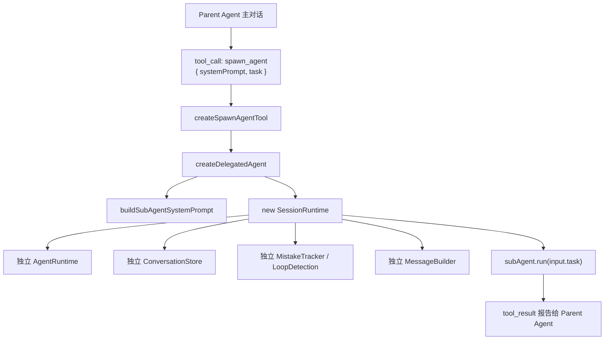

```typescript
// subagent-prompts.ts:23-41
function buildSubAgentSystemPrompt(prompt, config):
    if provider !== "cline": return trimmedPrompt
    return buildClineSystemPrompt({
        overridePrompt: trimmedPrompt,     // ⬅ 完全替代默认 Prompt！
        ide: config.clineIdeName || "Terminal",
        workspaceRoot: config.cwd || "/",
        metadata: config.workspaceMetadata,
    })
```

**关键**：Sub-agent 使用 `overridePrompt` 完全替代默认 System Prompt。默认 Rules 不会自动注入——用户必须在 `systemPrompt` 中显式写清楚约束。

#### Configured Agents — 预配置子 Agent

系统支持预配置的子 Agent（`.cline/agents/`），通过 `createConfiguredAgentTools()`（~253行）生成以 `subagent_<name>` 命名的工具：`ConfiguredAgentConfig { name, description, systemPrompt, providerId?, modelId?, maxIterations? }`。

### 13.3 Teams 何时触发 — enableAgentTeams 的完整启动流程

Team Agent 不是凭空存在的。它通过 `AgentConfig.enableAgentTeams = true` 在 Session 创建时激活，整个启动流程在 `runtime-builder.ts:buildTools()` 中完成：

**关键约束**：`team_spawn_teammate` 只有 lead 能调用；teammate 创建后自动注入 team 协作工具；跨 Session 持久化意味着重启后 Teams 状态可恢复。


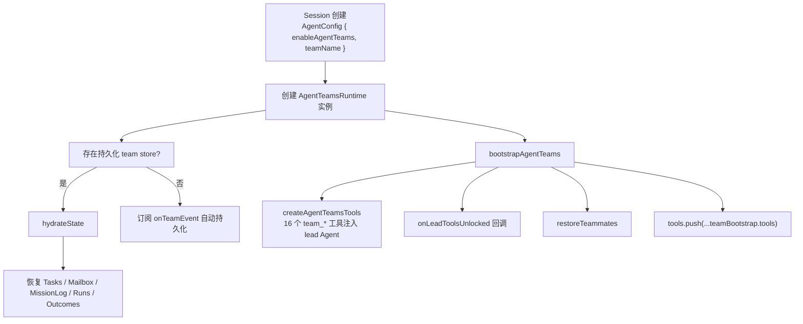

### 13.4 Teams 协作流程详解 — 核心循环

Teams 的协作模型是 **Lead 驱动的任务协调式协作**。核心循环由以下 7 个阶段组成：

```
① 创建队友:  lead → team_spawn_teammate({ agentId, rolePrompt })
              → runtime.spawnTeammate() → buildTeammateSystemPrompt（rules 注入）
              → new SessionRuntime(config) → 独立 Agent 沙箱

② 消息传递:  lead → team_send_message({ toAgentId, subject, body })
              → mailbox.push({ fromAgentId, toAgentId, readAt:null })
              teammate → team_read_mailbox({ unreadOnly:true, markRead:true })
              → 获取未读消息，标记已读后不重复

③ 任务分配:  lead → team_task({ action:"create", title, assignee })
              teammate → team_task({ action:"claim", taskId })
              → task.status: pending → in_progress

④ 执行工作:  lead → team_run_task({ agentId, task, runMode:"sync"|"async" })
              ├─ sync: 等待完成 ← 直接获得产出
              └─ async: 返回 runId ← 适合长任务
              → startTeammateRun() → dispatchQueuedRuns()
                ├─ getUnreadMail(agentId) → 注入未读消息
                ├─ teammateSession.run(task) / .continue(task)
                └─ status → completed/failed/cancelled

⑤ 完成任务:  teammate → team_task({ action:"complete", taskId, summary })
              → task.status = "completed"

⑥ 产出管理:  lead → team_create_outcome → team_attach_outcome_fragment
              → team_review_outcome_fragment → team_finalize_outcome
              → status: draft → in_review → finalized

⑦ 退出:     lead → team_shutdown_teammate({ agentId })
              → member.agent.abort() → status="stopped"
```

**并发控制**：`maxConcurrentRuns: 2`，队列中的 Run 按 FIFO 依次调度。每个 teammate 的 `startTeammateRun` 自动注入该 agent 的未读 Mailbox 消息到 System Prompt 中。

### 13.5 示例 — Worker-Reviewer + Lead 三 Agent 协作

以下是一个完整示例，场景：**实现用户认证模块，需要 Worker 编码 + Reviewer 审查 + Lead 协调**。

**前置条件**：Session 以 `enableAgentTeams: true` 创建。Lead（用户正在使用的 Agent）拥有全部 team_* 工具。


━━━━ 阶段 1: 组队 — Lead 创建 Worker 和 Reviewer ━━━━

  [Lead → team_spawn_teammate] agentId:"worker",

    rolePrompt:"You are a Senior Developer. Write clean TypeScript code..."

  → 内部: buildTeammateSystemPrompt → rules="# Team Teammate Role\n..."

  → new SessionRuntime(config) → 独立 Agent 沙箱

  → 返回: { agentId:"worker", status:"idle" }

  [Lead → team_spawn_teammate] agentId:"reviewer",

    rolePrompt:"You are a Code Reviewer. Focus on security, test coverage..."

  → 返回: { agentId:"reviewer", status:"idle" }

━━━━ 阶段 2: 任务分配 ━━━━

  [Lead → team_task] action:"create", title:"Implement auth module",

    assignee:"worker"

  → task_0001: status="in_progress"

  [Lead → team_task] action:"create", title:"Review auth module",

    assignee:"reviewer"         

  → task_0002: status="in_progress"

━━━━ 阶段 3: Worker 编码 ━━━━

  [Lead → team_run_task] agentId:"worker", runMode:"sync",

    task:"Implement auth with bcrypt + JWT. Files: src/auth/service.ts,

          src/auth/types.ts. Write unit tests."

  → 系统:

      startTeammateRun → dispatchQueuedRuns()

      → worker SessionRuntime.run(task) → 完整的 AgentRuntime 循环

        · read_file → 了解项目结构

        · write_to_file → src/auth/types.ts

        · write_to_file → src/auth/service.ts

        · write_to_file → src/auth/service.test.ts

        · execute_command → npm test (12/12 通过)

        · attempt_completion → "Auth module complete..."

      → run status="completed"

  [Worker → team_task] action:"complete", taskId:"task_0001",

    summary:"4 files created, all tests passing"

━━━━ 阶段 4: Reviewer 审查 ━━━━

  [Lead → team_send_message] toAgentId:"reviewer",

    subject:"Auth module ready", body:"Please review src/auth/*.ts"

  [Lead → team_run_task] agentId:"reviewer", runMode:"sync",

    task:"Check mailbox for review instructions.",

    continueConversation:true

  → startTeammateRun → getUnreadMail("reviewer") 注入未读消息

  → reviewer SessionRuntime.continue(task)

    · team_read_mailbox → 收到 Lead 的审查请求

    · read_file → 审查代码

    · 发现: JWT secret 硬编码在 service.ts:15

    · team_send_message → "Critical: hardcoded JWT secret!"

    · attempt_completion → 总结审查结果

  [Reviewer → team_task] action:"complete", taskId:"task_0002",

summary:"1 critical: JWT secret. 1 minor: missing email validation"

━━━━ 阶段 5: Lead 汇总并产出 ━━━━

  [Lead → team_create_outcome] title:"Auth Module Review Report",

    requiredSections:["Summary","Issues","Recommendations"]

  [Lead → team_attach_outcome_fragment] section:"Summary",

    content:"Auth module implemented..."

  [Lead → team_finalize_outcome]

  [Lead] attempt_completion("认证模块已完成。Worker 编码，Reviewer 发现1个关键问题。详细报告见 outcome_0001。")


**简化版 — 两行代码的 Worker-Reviewer 流水线**（`multi-agent.ts:479-508` 提供的便捷工厂）：

```typescript
const team = createWorkerReviewerTeam({
  worker:   { systemPrompt: "You write code...", providerId: "anthropic", modelId: "..." },
  reviewer: { systemPrompt: "You review code...", providerId: "anthropic", modelId: "..." },
});
// 一行执行: Worker 编码 → Reviewer 审查 → 返回两者结果
const { workerResult, reviewResult } = await team.doAndReview("Implement auth module");
// team.doAndReview() = team.routeTo("worker", msg) + team.routeTo("reviewer", workerResult.text)
```

#### mailbox 机制：跨 Agent 消息如何流转（以 13.5 示例为例）

Teams 的「网状协作」之所以成立，关键在于每个 Agent 都持有一份 mailbox（未读消息队列）。team_send_message 并不会把消息直接塞进对方正在跑的上下文，而是由其 runtime 把消息 push 进目标 Agent 的 mailbox[]；而当目标 Agent 被调度运行（team_run_task → startTeammateRun）时，runtime 会在注入 prompt 之前，自动从 mailbox[] 捞出所有未读消息，作为上下文喂给它。这正是前文 13.1 对比的「Sub-Agent 无通信工具、单向管道」与「Teams 通过 mailbox 异步通信」在示例中的落地。

```
// 每个 Agent 都有自己的 mailbox（未读消息队列），由 runtime 统一维护
mailbox = {
  lead:     [ /* 其它 Agent 发给 lead 的消息 */ ],
  worker:   [ /* 其它 Agent 发给 worker 的消息 */ ],
  reviewer: [ /* 其它 Agent 发给 reviewer 的消息 */ ],
}

// ① Lead 调用 team_send_message 给 reviewer 发审查请求（13.5 阶段 4）
[Lead → team_send_message] toAgentId:"reviewer",
  subject:"Auth module ready", body:"Please review src/auth/*.ts"

//   runtime 内部：把消息 push 进 reviewer 的 mailbox[]
mailbox.reviewer.push({
  from: "lead",
  subject: "Auth module ready",
  body: "Please review src/auth/*.ts",
  read: false,
})

// ② Lead 调度 reviewer 运行（reviewer 此时是「被调度」的一方）
[Lead → team_run_task] agentId:"reviewer",
  task:"Check mailbox for review instructions."

//   runtime 在启动 reviewer 的 AgentRuntime 循环前，自动捞未读：
unread = mailbox.reviewer.filter(m => !m.read)   // → [Lead 的审查请求]
mailbox.reviewer.forEach(m => m.read = true)     // 标记为已读
reviewer_prompt += formatUnread(unread)          // 注入到 reviewer 的 prompt 上下文
//   （对应源码：startTeammateRun → getUnreadMail("reviewer")）

// ③ reviewer 的 LLM 在 prompt 中看到这条未读消息，决定如何回复
[Reviewer → team_read_mailbox]  → 收到 Lead 的审查请求
[Reviewer → read_file]          → 审查代码
[Reviewer → team_send_message]  → "Critical: hardcoded JWT secret!"
//   runtime 内部：mailbox.lead.push(...) 把结果回写给 lead（或发给任意其它 Agent）
```

可以看到，整个过程中 Lead 与 reviewer 不需要同时在线：消息先落进 mailbox[]，等 reviewer 被调度时才被消费。这正是「异步、解耦」协作的体现——任意两个 Agent（lead↔teammate、teammate↔teammate）都可借助彼此的 mailbox[] 往来消息。反观 Sub-Agent：它没有 mailbox、没有 team_send_message，父给子任务、子返回结果即结束，子与子、子与父之间不存在任何通信渠道。因此 13.5 示例里能出现「Lead 发消息 → reviewer 被调度后读到并处理」这样的跨 Agent 交互，本质上就是 mailbox 在兜底层支撑。

### 13.6 DelegatedAgent — 统一工厂

`createDelegatedAgent()`（`delegated-agent.ts`, ~138行）是 Sub-agent 和 Teammate 的统一工厂。根据 `kind` 参数选择 System Prompt 构建方式，统一创建独立 `SessionRuntime`。

### 13.7 Subagent 在防跑偏中的角色

| 防跑偏机制 | 实现原理 |
| --- | --- |
| **上下文隔离** | 独立 `ConversationStore`，一个 Agent 跑偏不污染另一个 |
| **独立 System Prompt** | Sub-agent `overridePrompt` / Teammate `rules` 注入 |
| **独立安全检测** | 独立 `MistakeTracker` + `LoopDetectionTracker` |
| **工具集约束** | `createSubAgentTools` 动态构建子 Agent 工具集 |
| **独立迭代上限** | 独立 `maxIterations`，子 Agent 不会无限循环 |
| **独立 Completion 门控** | 子 Agent 必须调用终结工具才能返回 |
| **Teams 任务队列** | Task 依赖管理 + Run Queue 并发控制(maxConcurrentRuns:2) |
| **Teams Mailbox** | 跨 Agent 消息 + unreadOnly/markRead 模式 |

## 14. 用户 Steering 中途修正

### 14.1 机制概述

Steering 是用户在 Agent 执行过程中“中途纠正”的能力。它不同于初始输入——Steering 在 Consumer 模型下运作：

```xml
用户中途输入
  → 进入 PendingPromptsController 队列（不打断当前工具执行）
  → 下轮 beforeModel 前:
      consumePendingUserMessage()
      → 消费队列头部消息
      → 注入为 user message (格式: <user_input mode="act">steering text</user_input>)
      → 重构 request.messages
  → LLM 在下一轮对话中看到纠正指令
```

### 14.2 关键设计

- **不打断当前工具**：Agent 完成当前正在执行的工具后再消费 steering
- **作为 user role 注入**：与其他用户消息格式一致
- **多来源**：手动 UI 输入 / 桌面 IPC / Cron 定时任务 / 外部进程

### 14.3 防跑偏价值

- 是**唯一的人工干预通道**——所有自动化防线失效时的最后兜底
- 纠正信息在下轮立即生效，延迟不超过一个工具执行周期
- 可与其他防线联动（例如：LoopDetection 发出警告后用户通过 Steering 确认停止）

## 15. Extension / Plugin 体系

### 15.1 ContributionRegistry 架构

插件系统的注册中心，支持第三方动态扩展：

```
ContributionRegistry 能力:
  registerTool(tool)         → 注册自定义工具
  registerHook(hooks)        → 注册生命周期钩子
  registerRule(rule)         → 注册规则
  registerProvider(provider) → 注册 LLM Provider
  registerWorkflow(wf)       → 注册 Workflow
  unregister(id)             → 卸载
```

### 15.2 AgentExtension 接口

```typescript
interface AgentExtension {
  id: string
  init(ctx): Promise<void>     // 初始化（注册工具/规则/钩子）
  dispose(): Promise<void>     // 清理
}
```

### 15.3 加载顺序

```
1. 内置 Core Extensions (tools, hooks, safety checks)
2. MCP Extensions (MCP 协议连接的远程工具)
3. User Extensions (用户/工作区配置的插件)
```

### 15.4 在防线体系中的位置

Extension 体系是**横向贯穿能力**，不单独构成一道防线。它允许第三方在现有防线框架内注册自己的约束逻辑：

- 注册 `beforeTool` hook → 自定义工具执行前校验
- 注册 `afterTool` hook → 自定义执行后审计
- 注册 Rule → 注入额外 System Prompt 约束
- 注册 Tool → 扩展 Agent 能力边界

## 16. 多轮不偏离的反馈闭环（核心结论）

### 16.1 完整闭环图

### 16.2 核心机制不可绕过性评级


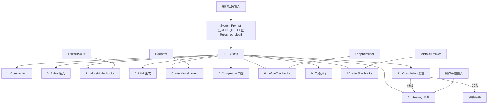

| 机制 | 类型 | 作用时机 | 不可绕过性 | 失败后果 |
| --- | --- | --- | --- | --- |
| `{{CLINE_RULES}}` | 契约 | 每轮 System Prompt | ⭐⭐ 模型可能忽略 | 行为偏移 |
| Completion 门控 | 硬约束 | 每次返回纯文本 | ⭐⭐⭐ 不调终结工具=继续 | 无法退出 |
| Tool Policy | 硬约束 | 每次工具调用前 | ⭐⭐⭐ 禁用/审批不可跳过 | 危险操作被拦截 |
| Hooks stop | 硬约束 | 任意生命周期节点 | ⭐⭐⭐ `ControlledStopError` | 立即终止 |
| MistakeTracker | 软→硬 | 连续错误积累 | ⭐⭐ 3→guidance, 5→abort | 自动终止 |
| LoopDetection | 软→硬 | 重复模式识别 | ⭐⭐ 3→warn, 5→skip | 循环被打破 |
| Steering | 人工 | 下轮 beforeModel | ⭐ 依赖用户主动介入 | 需人工发现 |

### 16.3 关键设计原则

1. **纵深防御**：单层失效不会导致整体跑偏。模型忽略 System Prompt → Completion 门控兜底；门控被绕过 → Hooks stop 兜底；自动化防线全失效 → Steering 人工兜底。
2. **软硬结合**：MistakeTracker 和 LoopDetection 采用“先提醒后强制”策略，给模型自我纠正的机会，减少误杀。
3. **运行时约束优于提示词约束**：旧架构的 FocusChain 依赖模型“听话”，新架构的 Completion 门控和 Tool Policy 是引擎级硬约束。
4. **上下文保鲜是隐性防线**：上下文过长是跑偏的放大器。Compaction + MessageBuilder 确保模型始终在最佳注意力窗口内工作。

## 17. 关键常量速查

### AgentRuntime

| 常量 | 值 | 说明 |
| --- | --- | --- |
| `DEFAULT_MAX_ITERATIONS` | 50 | 超出抛异常 |

### Completion Policy

| 配置项 | 类型 | 说明 |
| --- | --- | --- |
| `requireCompletionTool` | boolean | 是否强制完成工具 |
| `completionGuard` | callback | 额外守卫逻辑 |

### Compaction

| 常量 | 默认值 | 说明 |
| --- | --- | --- |
| `thresholdRatio` | 0.9 | 超过触发压缩 |
| `targetRatio` | 0.7 | 压缩目标比例 |
| `maxCompactionIterations` | 3 | 单次最大轮次 |
| summarizer maxOutputTokens | 1024 | Agentic 总结上限 |
| tool result 预截断 | 2000 chars | 压缩前预截断 |

### MessageBuilder

| 常量 | 默认值 | 环境变量覆盖 |
| --- | --- | --- |
| `maxToolResultChars` | 8,000 | `CLINE_MESSAGE_BUILDER_MAX_TOOL_RESULT_CHARS` |
| `maxFileContentChars` | 50,000 | - |
| `maxTotalTextBytes` | 6,000,000 | `CLINE_MESSAGE_BUILDER_MAX_TOTAL_TEXT_BYTES` |
| `maxAssistantTextChars` | 200,000 | - |
| `maxAssistantToolMarkupChars` | 12,000 | - |

### Safety

| 常量 | 值 | 说明 |
| --- | --- | --- |
| Mistake threshold (guidance) | 3 | 注入引导提示 |
| Mistake limit (abort) | 5 | 强制终止 |
| Loop SOFT warn | 3 次重复 | 注入警告 |
| Loop HARD skip | 5 次重复 | 跳过工具 |
| Loop window size | 最近 10 个调用 | 滑动窗口 |

## 18. v1 → v2 架构迁移对照表

| 旧架构 (v1) | 新架构 (v2 / SDK) | 变化说明 |
| --- | --- | --- |
| `core/task/index.ts` (~4500行) | `agent-runtime.ts` (~1650行) | Agent 循环下沉至 SDK |
| `system-prompt/components/` (17 个文件) | `shared/src/prompt/system.ts` (~73行) | 标准化为两套模板 |
| `focus-chain/` (4 个文件) | Completion 门控 + Hooks | 运行时约束替代提示词强制 |
| `ContextManager.ts` (~560行) | `compaction.ts` (~510行) | 上下文压缩下沉至 SDK |
| 手动 Rules 加载 | FSWatcher hot-reload | 文件变化即时注入 |
| VSCode 状态机 | AgentRuntime.state + SQLite | 轻量状态 + 持久化 |
| 无 Plugin 体系 | ContributionRegistry + AgentExtension | 完整插件系统 |
| gRPC 直接逻辑 | gRPC → 适配器 → SDK | 适配器模式解耦 |

