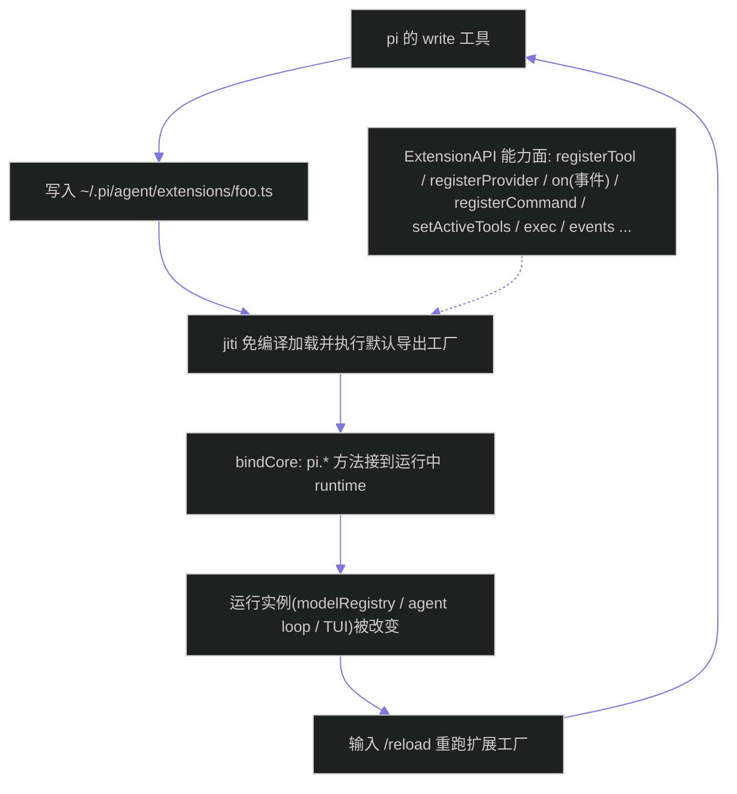
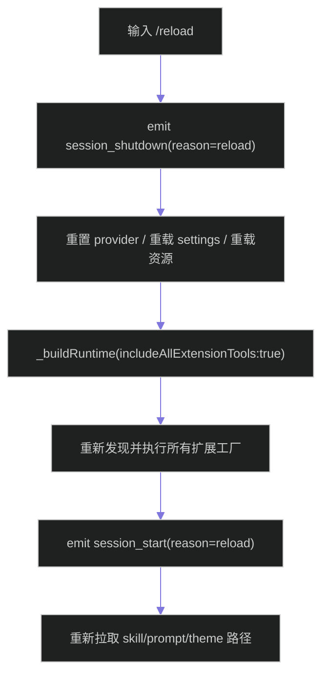
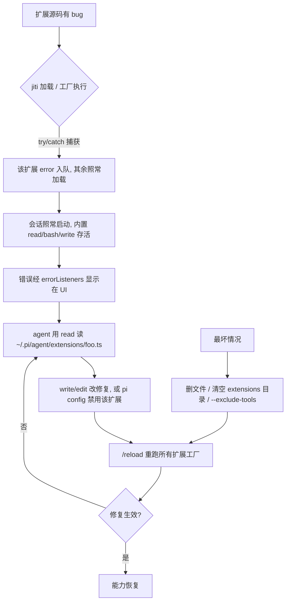
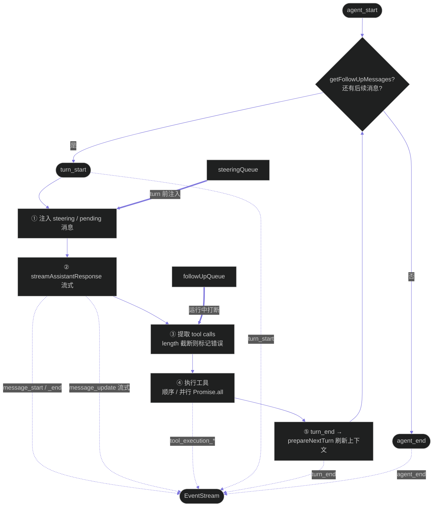
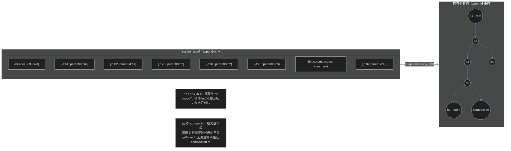
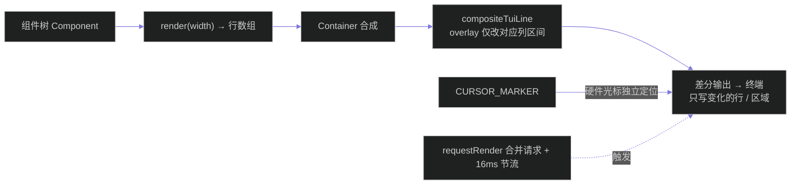
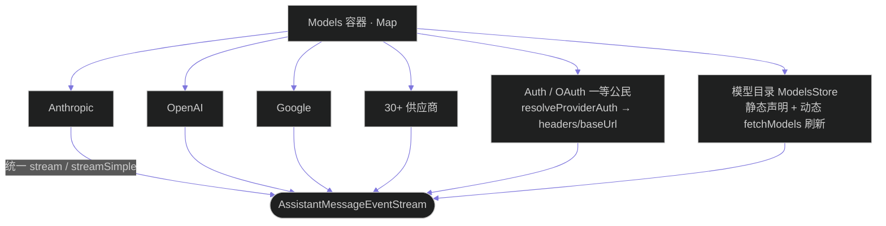

# pi Agent Harness：极简内核 + 深度可改造的 Coding Agent

> 调研对象：`earendil-works/pi` —— 一个以"刻意做减法"为核心主张的终端 coding agent harness。
>
> 本文聚焦三个问题：**它是什么形态的东西**、**它的运行机制如何**、**它与主流 Agent 的本质区别在哪**。
>
> 数据采集时间：2026-08-02。仓库状态：82,017 stars / 10,140 forks / MIT / TypeScript。

---

## 目录

1. [项目速览](#1-项目速览)
2. [整体形态：它不是产品，是 harness](#2-整体形态它不是产品是-harness)
   - [2.1 四层包结构](#21-四层包结构)
   - [2.2 四种运行形态](#22-四种运行形态)
   - [2.3 交互模式](#23-交互模式)
3. [核心设计理念："我们没有建造什么"](#3-核心设计理念我们没有建造什么)
   - [3.1 六项刻意缺失及其论证](#31-六项刻意缺失及其论证)
   - [3.2 自扩展：让 agent 改造自己](#32-自扩展让-agent-改造自己)
   - [3.3 上下文工程作为第一性目标](#33-上下文工程作为第一性目标)
4. [运行机制拆解](#4-运行机制拆解)
   - [4.1 agent loop 与事件流](#41-agent-loop-与事件流)
   - [4.2 工具执行与拦截点](#42-工具执行与拦截点)
   - [4.3 会话树与压缩](#43-会话树与压缩)
   - [4.4 扩展系统：进程内 vs 进程外](#44-扩展系统进程内-vs-进程外)
   - [4.5 代码组织：packages 全貌](#45-代码组织packages-全貌)
   - [4.6 技能系统（SKILL.md + 文件系统发现）](#46-技能系统skillmd--文件系统发现)
   - [4.7 pi-tui 差分渲染](#47-pi-tui-差分渲染)
   - [4.8 pi-ai 统一多供应商抽象](#48-pi-ai-统一多供应商抽象)
   - [4.9 上下文文件与包管理](#49-上下文文件与包管理)
   - [4.10 源码索引（可溯源文件）](#410-源码索引可溯源文件)
5. [与其他 Agent 的本质区别](#5-与其他-agent-的本质区别)
   - [5.1 定位差异](#51-定位差异)
   - [5.2 能力边界差异](#52-能力边界差异)
   - [5.3 运行机制差异](#53-运行机制差异)
   - [5.4 适用场景差异](#54-适用场景差异)
   - [5.5 横向总表](#55-横向总表)
6. [用 T1–T4 检验 pi](#6-用-t1t4-检验-pi)
7. [独特性总结](#7-独特性总结)
8. [局限性与风险](#8-局限性与风险)
9. [参考来源](#9-参考来源)

---

## 1. 项目速览

| 项目 | 内容 |
|------|------|
| 仓库 | `github.com/earendil-works/pi` |
| 官网 | `pi.dev` |
| 许可 | MIT（完全开源） |
| 语言 | TypeScript（npm workspaces monorepo） |
| 创建时间 | 2025-08-09 |
| 热度 | 82,017 stars / 10,140 forks（2026-08-02） |
| 主要作者 | Mario Zechner（`badlogic`，libGDX 作者，3462 commits）、Armin Ronacher（`mitsuhiko`，Flask/Jinja 作者，456 commits） |
| 主体 | Earendil Inc. |
| 官方定位 | "There are many agent harnesses, but this one is yours." |

一句话概括：**pi 把"coding agent 应该内置什么功能"这个问题反过来回答了——它内置得极少，但把改造自身的能力开放到了极致。**

---

## 2. 整体形态：它不是产品，是 harness

### 2.1 四层包结构

pi 不是一个单体 CLI，而是四个可独立使用的 npm 包。这决定了它既能当成品工具用，也能当基础设施用。

```
              ┌───────────────────────────────────────────┐
   运行入口    │ 交互式 TUI │ Print/JSON │ RPC │ SDK 嵌入 │
              └─────────────────────┬─────────────────────┘
                                    ↓
  ┌──────────────────────────────────────────┬──────────────┐
  │ @earendil-works/pi-coding-agent          │ pi-tui       │
  │ 会话树 · 扩展 · 技能 · 包管理 · 上下文文件 │ 差分渲染 TUI │
  └──────────────────────────────────────────┴──────────────┘
                                    ↓
  ┌─────────────────────────────────────────────────────────┐
  │ @earendil-works/pi-agent-core                           │
  │ agent loop · 工具调用 · 状态管理 · 事件流 · 转向队列      │
  └─────────────────────────────────────────────────────────┘
                                    ↓
  ┌─────────────────────────────────────────────────────────┐
  │ @earendil-works/pi-ai                                   │
  │ 统一多供应商 LLM API · 流式 · 缓存 · 思考等级             │
  └─────────────────────────────────────────────────────────┘
                                    ↓
     Anthropic │ OpenAI │ Google │ Bedrock │ llama.cpp │ 30+ 家
```

关键含义：

- 只想要一个**跨厂商 LLM SDK** → 单用 `pi-ai`；
- 想自己写一个形态完全不同的 agent → 用 `pi-agent-core` 提供的 `agentLoop()`；
- 想要现成的编码 agent → 用 `pi-coding-agent`。

CLI 只是这套工具箱最上层的**参考实现**，而不是唯一形态。这与"CLI 即产品本体"的主流 agent 有根本区别。

### 2.2 四种运行形态

| 模式 | 命令 | 用途 |
|------|------|------|
| 交互式 | `pi` | 完整 TUI 体验 |
| Print / JSON | `pi -p "query"` / `--mode json` | 脚本化调用、事件流消费 |
| RPC | `pi --mode rpc` | stdin/stdout 上的 JSONL 协议，供非 Node 语言集成 |
| SDK | `createAgentSession()` | 嵌入自有应用 |

RPC 模式使用严格的 LF 分隔 JSONL 帧（官方特别警告不要用 Node `readline`，因为它会在 JSON 载荷内部的 Unicode 分隔符处错误断行）。真实案例：OpenClaw 项目选择基于 pi 而非 Claude Code SDK 构建。

### 2.3 交互模式

交互形态上 pi 有几个不常见的设计：

- **消息队列区分"转向"与"追问"**：`Enter` 发送 steering 消息，在当前助手回合的工具调用结束后立即送达，可打断后续工具；`Alt+Enter` 发送 follow-up，等 agent 全部干完再送达。这是把"插话"和"排队"在协议层分开。
- **`!command` / `!!command`**：前者执行 shell 并把输出送给模型，后者执行但不送给模型。用户对上下文有直接开关。
- **会话树导航**：`/tree` 可跳到历史任意一点继续，所有分支存在同一个 JSONL 文件里。
- **导出与分享**：`/export` 导出 HTML，`/share` 上传为私有 gist 并给出可渲染链接。

---

## 3. 核心设计理念："我们没有建造什么"

pi 官网有一个专门板块叫 **"What we didn't build"**。同类项目通常罗列功能，pi 罗列的是**放弃**——并为每一项给出替代路径。这是理解 pi 的钥匙。

### 3.1 六项刻意缺失及其论证

| 缺失项 | 官方论证 | 替代路径 |
|--------|----------|----------|
| **No MCP** | MCP server 把全部工具描述塞进每次会话的上下文。作者实测 Playwright MCP 有 21 个工具、13.7k tokens，"还没开始干活就吃掉 7–9% 的上下文窗口" | 写带 README 的 CLI 工具，模型需要时才读（渐进式披露），用 bash 调用；或自己写扩展加 MCP 支持 |
| **No sub-agents** | "你对子代理在做什么零可见性。这是黑箱套黑箱。" 并行派多个子代理实现功能被作者视为反模式 | 用 tmux 拉起多个 pi 实例；或用扩展自建；或装第三方包 |
| **No plan mode** | 让模型在不改文件的前提下和你一起想清楚，通常就够了 | 把计划写进 `PLAN.md` 文件；或用扩展实现 |
| **No permission popups** | "其他 coding agent 的安全措施大多是安全戏剧。一旦 agent 能写代码又能跑代码，基本就结束了。" 读数据、执行代码、网络访问这三者无法既全给又安全 | 跑在容器里；或用扩展自建确认流 |
| **No built-in to-dos** | "待办清单通常让模型更糊涂而不是更清楚。它增加了模型必须追踪和更新的状态，也就增加了出错机会。" | 用 `TODO.md` 文件 |
| **No background bash** | 后台进程管理增加复杂度，且可观测性差 | 用 tmux，完全可观测、可直接交互 |

这六项的共同逻辑不是"做不出来"，而是**这些能力被下沉到了扩展层**。官方仓库直接提供了 subagent、plan-mode、permission-gate、sandbox 等 50+ 个扩展示例——**你可以拥有这些功能，只是不由内核替你决定形态**。

作者原话概括了整个哲学：

> "if I don't need it, it won't be built. And I don't need a lot of things."

以及对现状的批评：

> "过去几个月里，Claude Code 变成了一艘宇宙飞船，其中 80% 的功能我用不上。系统提示和工具还每次发版都改，这会破坏我的工作流、改变模型行为。"

### 3.2 自扩展：让 agent 改造自己

这是 pi 最反常识、也最容易被低估的一点。README 称其为 "self extensible coding agent"，官网表述为：

> "Pi isn't a sealed product. If you need a command, tool, provider, workflow, or UI tweak, just ask Pi to build it. It will customize itself on the fly. Have Pi manipulate itself in place, hit `/reload`, and keep going."

它的实现并不神秘，而是**几个既有能力的组合恰好闭环**：



下钻到 `main` 分支真实代码（`packages/coding-agent/src/core/extensions/`），这一闭环的每一步都有对应实现。

#### 3.2.1 机制：扩展如何被加载、接线、生效

**1. 扩展就是普通 `.ts` 文件，免编译加载。** 加载器 `loader.ts` 用 `createJiti()` 直接 `jiti.import(extensionPath, { default: true })` 运行 TypeScript —— **没有构建步骤、没有 `tsc`/打包**，改完保存即可被加载。模块的**默认导出必须是一个工厂函数**：

```ts
export default function (pi) {
  // pi 就是 ExtensionAPI
}
```

**2. 扩展在哪里被发现。** `discoverAndLoadExtensions()` 按三处路径发现（同一级目录，不递归）：
- 项目级：`cwd/.pi/extensions/`（`cwd` 为当前工作目录，`.pi` 由 `config.ts` 的 `CONFIG_DIR_NAME` 决定）；
- 全局：`~/.pi/agent/extensions/`（`getAgentDir() = homedir()/.pi/agent`）；
- 显式配置的路径。

发现规则：文件 `extensions/*.ts`（或 `*.js`）直接加载；子目录需有 `index.ts`/`index.js`，或 `package.json` 里用 `pi.extensions` 字段声明入口。

**3. 扩展拿到的 `ExtensionAPI`（即 `pi` 对象）能力面极宽**，按用途大致分组：

| 类别 | 方法（节选） | 能做什么 |
|------|--------------|----------|
| 生命周期订阅 | `pi.on(event, handler)` | 订阅约 30 类事件：`agent_start`、`turn_start`、`tool_call`、`before_agent_start`、`message_*`、`session_*`、`before_provider_request` 等；handler 可**改写/替换**消息、`block` 工具、注入/修改请求头 |
| 注册能力 | `registerTool` / `registerCommand` / `registerShortcut` / `registerFlag` | 给模型加新工具、加斜杠命令、加快捷键、加 CLI 参数 |
| 改模型层 | `registerProvider(name, config)` / `unregisterProvider` | **注册或覆盖**模型供应商（自定义 `baseUrl`/`apiKey`/`api`/`models`/OAuth） |
| 改运行态 | `setActiveTools` / `setModel` / `setThinkingLevel` | 改当前生效的工具集、切换模型、调思考等级 |
| 改渲染 | `registerMessageRenderer` / `registerMarkdownTransformer` / `registerEntryRenderer` | 自定义消息/Markdown/条目渲染 |
| 动作 | `sendMessage` / `sendUserMessage` / `appendEntry` / `exec` / `events` | 发消息、执行 shell、向扩展间通信的 EventBus 发事件 |

**4. 等价于"改源码运行"的关键在接线。** `runner.ts` 的 `bindCore()` 把这些 API 方法**直接接到运行中的 runtime 实现**上，例如：

```ts
this.runtime.registerProvider = (name, config) => {
  this.modelRegistry.registerProvider(name, config);  // 直接写入运行中的模型注册表
};
```

也就是说，扩展里调一次 `pi.registerProvider(...)` / `pi.setActiveTools(...)`，效果等同于你打开框架源码、在对应位置插入这行代码后重新运行 —— 但无需动框架、无需重启进程。加载阶段排队的 provider 注册会在 `bindCore` 时一次性 flush；`bindCore` 之后注册立即生效，**连 `/reload` 都不需要**。

**5. 扩展能复用框架自身。** 加载器通过 `virtualModules`/`alias` 把 `@earendil-works/pi-agent-core`、`pi-ai`、`pi-tui`、`pi-coding-agent`、`typebox` 等暴露给扩展。因此扩展可以 `import { defineTool } from "@earendil-works/pi-coding-agent"` 复用框架的类型与辅助函数，甚至包裹、替换内置实现（例如继承 `CustomEditor` 写一个 Vim 键位编辑器）。

#### 3.2.2 热重载：`/reload` 重跑扩展工厂

`agent-session.ts` 的 `reload()` 做了这件事：



交互模式里的 `/reload` 命令（`interactive-mode.ts` 中 `text === "/reload"` 分支）即调用此流程。一句话：**改一个 `.ts` 扩展文件 → 输入 `/reload` → 立即以新逻辑运行，进程不重启**。

#### 3.2.3 一个最小可运行的例子：给自己加一个工具

假设你想让 pi 能查天气。在全局扩展目录新建一个文件：

```bash
# 路径：~/.pi/agent/extensions/weather.ts
```

```ts
import { defineTool } from "@earendil-works/pi-coding-agent";

export default function (pi) {
  pi.registerTool(
    defineTool({
      name: "current_weather",
      label: "Current Weather",
      description: "Get the current weather for a city",
      // 参数用 TypeBox / JSON-Schema 形态描述
      parameters: {
        type: "object",
        properties: { city: { type: "string" } },
        required: ["city"],
      },
      async execute(_id, { city }, _signal, _onUpdate, _ctx) {
        const r = await fetch(`https://wttr.in/${encodeURIComponent(city)}?format=3`);
        const text = await r.text();
        return { type: "text", content: text };
      },
    }),
  );
}
```

然后：
1. 在 pi 会话里输入 `/reload`（或重启 pi）；
2. 之后你（或模型）就能说"查下北京天气"，模型会调用 `current_weather` 工具。

同样的方式还能做更多——都是"形式化地改造框架"：

- **覆盖模型供应商**：`pi.registerProvider("anthropic", { baseUrl: "https://你的代理", api: "anthropic-messages", apiKey: "$MY_KEY" })`，把请求转到自建网关，无需改任何源码。
- **进程内拦截（hook 的进程内版本）**：`pi.on("tool_call", (e) => { if (e.toolName === "bash") e.input.command = e.input.command.replace("rm -rf", "echo blocked"); })` 在工具执行前就地改写参数；或 `pi.on("before_agent_start", (e) => { e.systemPrompt = e.systemPrompt + "\n始终用中文回复。"; })` 每轮注入指令。这正是"进程外 hooks 做不到"的那类事——你能改 `agent loop` 与上下文本身，而不只是在生命周期点打补丁。

#### 3.2.4 闭环：agent 改写自己

把上面的零件拼起来，就是 pi 所谓的 "self extensible" 的本质：

```
pi 有 write 工具                                    ──┐
扩展就是 ~/.pi/agent/extensions/ 下的普通 .ts 文件    ──┤
扩展由 jiti 直接运行 TS，无需编译                     ──┼──→ agent 能写出自己的新能力
扩展 API 文档就在仓库里（types.ts 即契约），agent 能 read ──┤  并当场 /reload 生效
/reload 可热重载扩展                                 ──┘
```

你不需要 fork 仓库、不需要发 PR、不需要懂构建系统。让 pi 读扩展 API 契约（就是 `packages/coding-agent/src/core/extensions/types.ts`），在 `~/.pi/agent/extensions/` 下写一个 `.ts`，`/reload` 即可。如果它自己来完成这件事——用 `write` 写扩展文件、用命令触发 `/reload`——就形成了"agent 就地改造自己、继续往下干"的闭环。

对比来看：Claude Code 的 hooks 是**进程外**的，只能在预设生命周期点上拦截，改不了 TUI、改不了 agent loop、替换不了内置工具。pi 的扩展是**进程内 TypeScript**，能注册/覆盖工具（包括覆盖内置的 `read`/`bash`）、注册 provider、替换编辑器与整个 UI、改写上下文、接管压缩逻辑。

这是"改配置"和"改程序"的区别。

### 3.2.5 边界、风险与自举排错

"等价于改源码"这句话需要精确化：**只在框架刻意暴露的接缝处才等价于改源码**，并非能改写任意代码。理解这条边界，才能说清"改出 bug 怎么办"。

**能改什么（ExtensionAPI 暴露的接缝）**。扩展拿到的 `ExtensionAPI`（`packages/coding-agent/src/core/extensions/types.ts:1193`）是一份被裁剪过的能力清单：`registerTool` / `setActiveTools`（可把内置 `read`/`bash` 移出激活集）、`registerProvider` / `unregisterProvider`、`on(event)`（订阅约 40 类生命周期事件，handler 内能改消息、`block` 工具、改请求头）、`registerCommand` / `registerShortcut` / `registerFlag`、覆盖 UI 渲染器、改模型与思维等级、`exec` 跑命令。`runner.ts` 的 `bindCore()` 把这些调用直接接到运行中的 `modelRegistry` 等核心对象——所以调一次 `pi.registerProvider`，效果等同于在框架源码对应位置插这行后重新构建。**这就是"等价于改源码"的真实含义：在接缝处。**

**改不到什么（不 fork 动不了）**。agent loop 的控制流语义、`pi-tui` 的差分渲染算法本身、`session.jsonl` 的持久化格式、provider 归一化的内部逻辑——这些被编译进包，API 没有改写入口。要动它们只能 **fork 仓库 → 改 `packages/agent/src/agent-loop.ts` 等 → 自己 build → 从源码跑**。那才算"改所有代码"，但属于 fork，不是产品内自扩展。

**坏扩展不会让 pi 起不来——设计上就防了一层**（`loader.ts:472-553` 实锤）：

- **逐扩展隔离**：每个扩展的加载是独立 `try/catch`，工厂抛错只返回 `{ extension: null, error }`，不冒泡；批量加载器把错误收进 `errors[]` 后继续加载其余扩展。结果：**一个扩展炸了，只有它自己没注册上，会话照样启动**。
- **错误不静默**：`runner.ts:563` 的 `emitError` + `errorListeners` 把扩展错误推给 UI 显示，agent 和用户都看得到。
- **内置工具永不被连坐**：`read`/`bash`/`write` 由框架核心注册，坏扩展在工厂阶段就抛错、什么都没注册，内置工具毫发无损——**agent 永远保留 read/write/bash 用于自救**。

**恢复路径（从软到硬）**：

1. **agent 自举排错**：错误已显示 → agent 用 `read` 打开自己的扩展文件（`read ~/.pi/agent/extensions/foo.ts`）→ 用 `write`/`edit` 改好 → `/reload` 重跑所有扩展工厂（`agent-session.ts` 的 `reload()`）。jiti 按需编译，语法错在加载期即被 catch，不会跑到一半崩；agent 还能用 `bash` 先 `tsc --noEmit` 或 `node` 给扩展文件做类型检查再 `/reload`。
2. **资源式禁用**：扩展作为"资源"管理（`resource-loader.ts` 的 `getEnabledPaths`），`pi config` TUI 可 enable/disable 某个扩展（Tab 切作用域），不删文件即可关掉坏的。
3. **CLI 黑名单**：启动时 `--exclude-tools` / `-xt` 直接禁用某些工具名。
4. **清目录**：删 `~/.pi/agent/extensions/` 或 `cwd/.pi/extensions/` 下坏文件，或整目录清空；pi 核心是普通 npm 包，不依赖任何扩展也能跑。



一句话：**自扩展是"在框架留好的钩子上贴插件"，不是"把整个程序当橡皮泥捏"；坏一个插件因逐扩展隔离 + 内置工具兜底而不会让 pi 起不来，agent 恰好能用仅存的 read/write/bash 把坏插件改好再 `/reload`——这就是它"自己 debug 自己"的闭环。**

### 3.3 上下文工程作为第一性目标

pi 的极简不是美学偏好，而是为了**把上下文窗口的控制权交还给用户**：

- 系统提示 + 工具定义合计 **< 1000 tokens**（作者自述）。作为对比，第三方测算 Claude Code 的系统提示约 14k tokens。
- 内置工具只有四个：`read`、`write`、`edit`、`bash`（另有可选的 `grep`、`find`、`ls`）。作者判断："这四个工具就是一个高效 coding agent 的全部所需。模型知道怎么用 bash，也在 read/write/edit 这类工具上被训练过。"
- `SYSTEM.md` 可**整体替换**默认系统提示，`APPEND_SYSTEM.md` 可追加。
- 压缩逻辑可被扩展完全接管（按主题压缩、代码感知摘要、换个模型做摘要都行）。
- 扩展可在每轮之前注入消息、过滤历史、实现 RAG 或长期记忆。

作者对现有工具最尖锐的批评正在此处：

> "现有的 harness 让这件事极其困难甚至不可能——它们在你背后注入东西，而这些东西甚至不在 UI 里显示。"

---

## 4. 运行机制拆解

> 以下各小节均下钻至 `main` 分支真实源码（`packages/` 下）逐一确认机制与架构，不贴代码；可溯源文件见 4.10。

### 4.1 agent loop 与事件流

`pi-agent-core` 的循环是一个**可观测的事件流**，而不是黑箱。一次带工具调用的 `prompt()` 会产生：

```
prompt("读 config.json")
├─ agent_start
├─ turn_start
│   ├─ message_start / message_end     { userMessage }
│   ├─ message_start                   { assistantMessage with toolCall }
│   ├─ message_update ...              流式增量
│   ├─ message_end
│   ├─ tool_execution_start            { toolCallId, toolName, args }
│   ├─ tool_execution_update           { partialResult }  工具可流式回报
│   ├─ tool_execution_end              { toolCallId, result }
│   ├─ message_start / message_end     { toolResultMessage }
│   └─ turn_end                        { message, toolResults }
├─ turn_start                          下一回合：模型对工具结果作出反应
│   └─ ...
└─ agent_end
```

两个值得注意的设计：

- **消息类型可扩展**。`AgentMessage` 通过 TypeScript declaration merging 支持自定义角色（如 `notification`），再由 `convertToLlm()` 决定哪些进入真正发给 LLM 的消息序列。**UI 层消息与 LLM 层消息被显式分离**。
- **`message_end` 是屏障**。用 `Agent` 类时，助手消息处理完才开始工具预检，因此 `beforeToolCall` 看到的状态一定已包含那条发起调用的助手消息。低层 `agentLoop()` 不保证这一点——它只保证事件顺序，不等待异步处理落定。

源码 `packages/agent/src/agent-loop.ts` + `agent.ts` 揭示了一个**双层循环**结构：

- **外层循环（turn 层）**：控制"轮次是否因后续消息而继续"。每轮结束前轮询 `getFollowUpMessages()`——若用户在外层追加了输入，循环不退出而是继续。
- **内层循环（工具层）**：处理单次 turn 内的工具调用与转向消息，直到"无待处理消息 且 无可执行工具调用"才退出内层。
- **工具执行**：支持 `sequential`（逐个、可中途 abort）与 `parallel`（`Promise.all` 并发、结果按原序整理）；若 `stopReason === "length"`（输出 token 超限），所有 tool call **直接标记为错误不执行**，避免残缺参数。
- **停止判定**：`error` / `aborted`、`shouldStopAfterTurn` 钩子、内层无 tool call 且无 pending 且外层 follow-up 为空、全部 tool result `terminate:true`（仅结束内层）。
- **事件流**：`EventStream` 以 `agent_end` 为终结，全程广播 `agent_start → turn_start → message_* → tool_execution_* → turn_end → agent_end`；`Agent`（`agent.ts`）作为有状态封装层，消费事件、维护转录、并通过 `steeringQueue` / `followUpQueue`（`PendingMessageQueue`）对外暴露转向/后续注入 API——这就是"运行中不打断地影响后续对话"的实现底座。




### 4.2 工具执行与拦截点

```
模型返回 toolCall
  ↓
tool_execution_start
  ↓
参数按 TypeBox schema 校验
  ↓
beforeToolCall  ──→ 可返回 { block: true, reason } 直接拦截
  ↓
execute()        parallel 默认并发 / sequential 串行
  ↓
afterToolCall   ──→ 可改写结果、可返回 { terminate: true }
  ↓
tool_execution_end → toolResult 消息
```

细节：

- 并行模式下**完成事件按完成顺序发出，但持久化的 toolResult 消息仍按助手源顺序排列**——保证会话文件可复现。
- 单个工具可用 `executionMode: "sequential"` 强制整批串行。
- `terminate: true` 只有在**该批次所有工具结果都终止**时才真正跳过后续 LLM 调用，混合批次照常继续。
- 工具抛异常即视为失败（`isError: true`）；官方明确要求不要把错误信息当作正常内容返回。

源码 `packages/agent/src/harness/agent-harness.ts` 是一个泛型类 `AgentHarness`，把 loop / 工具 / 模型 / 上下文 / 会话 / 扩展全部编织起来：

- **入口**：`prompt()` / `skill()` / `promptFromTemplate()` 检查 `phase === "idle"` 后建 `TurnState` 并调 `runAgentLoop`。
- **工具接线**：构造时 `options.tools` 经 `validateUniqueNames` 存入 `Map`；`activeToolNames` 决定启用集。`bindToolContext(tool, context)` 把解析后的 `toolContext` 注入每个工具的 `execute` 末参——即"工具在调用时自动拿到上下文"。`beforeToolCall` / `afterToolCall` 钩子可阻断或修改结果。
- **上下文每回合重建**：`createTurnState()` 取 `session.buildContext()` + `resolveToolContext()` + 系统提示（字符串或函数动态生成）→ `createContext()` 绑定 `activeTools`。每轮 `prepareNextTurn` 刷新快照，实现"下一回合重算上下文"。
- **持久化延迟刷盘**：非 idle 阶段的变更不直接写，而是推入 `pendingSessionWrites` 队列，在 `turn_end` / `agent_end` 时 `flushPendingSessionWrites()` 顺序消费（消息、模型变更、压缩记录、分支导航等）。

### 4.3 会话树与压缩

会话以 **JSONL 树结构**存储，每条记录带 `id` 和 `parentId`：

```
session.jsonl（单文件内含全部分支）
  entry(id=1, parent=null)   用户提问
   └ entry(id=2, parent=1)   助手回答
      ├ entry(id=3, parent=2)   分支 A  ← /tree 可跳回此处
      └ entry(id=7, parent=2)   分支 B
```

- `/tree`：原地跳到任意历史点继续，分支间自由切换，全部历史保留在一个文件里。
- `/fork`：从某条用户消息切出**新会话文件**。
- `/clone`：把当前活动分支复制成新会话。
- **压缩是有损的，但原始历史不丢**——完整记录仍在 JSONL 里，`/tree` 随时可回溯。

这是与"线性会话 + resume"模型的实质区别：pi 的历史是**可导航的树**，不是可回放的磁带。

源码 `packages/agent/src/harness/session/session.ts` + `jsonl-store.ts` 确认了上面的"会话树"结构：

- **存储即 JSONL**：每个会话对应一个 `.jsonl` 文件，首行为 `SessionHeader`（`version: 3`、cwd、可选 parentSession），其后**每行一个 `SessionTreeEntry`**（`fs.appendFile` 仅追加，绝不修改历史行）。加载时全量解析进内存镜像，后续读操作基于内存数组。
- **树由 `id` / `parentId` 隐式表达**：条目本身携带父指针，从任意叶子沿 `parentId` 上溯即达根；不同条目可共享同一 `parentId` → 多分支。`leafId` 游标标记"当前所在分支顶端"。
- **分支 = 移动游标**：`moveTo(entryId)` 把 `leafId` 指向历史某节点并写一个 `leaf` 类型条目；此后新条目以该节点为父，即从历史某点开出新枝。`getBranch()` 沿 `parentId` 上溯至根或**最近的 compaction 点**。
- **压缩点折叠旧历史**：`compaction` 条目含 `summary` / `firstKeptEntryId`；组装上下文时 `defaultContextEntryTransform` 只保留压缩点之后（或压缩点前后部分）的条目，旧历史被摘要替代但**树结构不丢**。`branch_summary` 节点则标记从某点分叉的总结。
- **append-only 的物理含义**：压缩不在原文件就地改，而是逻辑标记/新建文件（类似 fork）实现，保证历史可追溯。




### 4.4 扩展系统：进程内 vs 进程外

扩展是导出默认工厂函数的 TypeScript 模块，由 jiti 直接运行、无需编译：

```typescript
export default function (pi: ExtensionAPI) {
  pi.registerTool({ name: "deploy", ... });
  pi.registerCommand("stats", { ... });
  pi.on("tool_call", async (event, ctx) => { ... });
}
```

可订阅的事件覆盖近乎全部生命周期：`project_trust`、`resources_discover`、`session_start`、`session_before_compact`、`before_agent_start`、`turn_start/end`、`context`（LLM 调用前改消息）、`before_provider_request`、`after_provider_response`、`tool_call`（可阻断）、`tool_result`（可改写）、`user_bash`（可拦截用户的 `!` 命令）、`input`（可转换用户原始输入）等。

可覆盖的对象包括：**内置工具**（注册同名即覆盖）、**模型 provider**、编辑器、状态栏、页脚、浮层、Markdown 渲染。

扩展 / 技能 / 提示模板 / 主题可打包成 **Pi Package**，经 npm 或 git 分发：

```bash
pi install npm:@foo/pi-tools
pi install git:github.com/user/repo@v1
```

安全边界由**项目信任（project trust）**机制承担：交互式启动时，若项目含本地设置或 `.agents/skills` 且无既往决定，pi 会先询问。在信任决定作出之前，只加载上下文文件与用户级/CLI 扩展，项目级扩展与设置一律不加载。非交互模式（`-p`、`json`、`rpc`）不弹窗，改用 `defaultProjectTrust` 策略。

源码 `packages/coding-agent/src/extensions/index.ts` 显示：内置扩展以 `InlineExtension`（`{ name, factory, hidden }`）注册（如 `llama.cpp`）；用户扩展则是 `~/.pi/agent/extensions` 下的 **TypeScript 文件**，由运行时扫描并以 **jiti 免编译直接执行**，接收 harness API。结合 4.2 的 harness 接线（`set*` 热重载）（`setTools` / `setActiveTools` / `setModel` / `setThinkingLevel` / `setResources` 立即生效并触发 `_update` 事件）与 `subscribe` / `on` 事件订阅——

> **这就闭环了第 3.2 节的"自扩展"**：agent 有 write 工具 → 写出 `.ts` 扩展 → `/reload` 重跑加载器 → 新能力（覆盖内置工具、注册 provider、替换 UI、接管压缩）当场生效。扩展能力在代码层面**等价于改源码**，这是它与 Claude Code 进程外 hooks 的本质区别。

### 4.5 代码组织：packages 全貌

上一章提到的"四层 npm 包"（`pi-agent-core` / `pi-coding-agent` / `pi-tui` / `pi-ai`）仍是理解 pi 的正确心智模型，但仓库在 2025 年底做了一次拆分与扩展。`packages/` 当前包含 9 个包：

| 包 | 对应心智层 | 职责 |
|----|-----------|------|
| `agent` | = pi-agent-core | agent loop、harness 接线、工具、会话树、技能、压缩 |
| `ai` | = pi-ai | 统一多供应商 LLM API、流式、认证/OAuth、模型目录 |
| `tui` | = pi-tui | 差分渲染终端 UI 框架 |
| `coding-agent` | = pi-coding-agent | CLI、会话树持久化、扩展、技能、包管理、上下文文件 |
| `client` / `server` / `protocol` / `storage` / `evals` | 配套基础设施 | RPC 客户端、服务端、协议定义、存储抽象、评测 |

> 结论：**四层心智模型仍然成立**，只是被拆得更细，并长出了配套的 client/server/protocol/storage/evals 基础设施（对应 README 里提到的 RPC、SDK 嵌入等运行形态）。

### 4.6 技能系统（SKILL.md + 文件系统发现）

源码 `packages/agent/src/harness/skills.ts` 表明：**技能本质是被文件系统发现、带元数据的"提示模板"，调用时包成 XML 块注入上下文——不是独立进程**。

- **定义**：技能是带 YAML frontmatter 的 `SKILL.md`（或根目录 `.md` 文件）。frontmatter 含 `name`（须匹配父目录名，仅小写 `a-z0-9-`、`description`（必填、≤1024、`disable-model-invocation`。
- **发现**：`loadSkills(env, dirs)` 递归遍历目录、加载 `SKILL.md` 与根 `.md`、honor `.gitignore`/`.ignore`，对非法元数据产出 `diagnostics` 警告而非崩溃。
- **调用**：`formatSkillInvocation(skill)` 把技能正文包进 `<skill name="..." location="...">...</skill>` XML 块，作为普通 prompt 注入——模型"按需调用技能"实则是被引导去读这段上下文。这正是第 3 章"上下文工程"的延伸：能力下沉到可被模型检索的文本，而非硬编码工具。

### 4.7 pi-tui 差分渲染

源码 `packages/tui/src/tui.ts` + `index.ts` 揭示 pi 的 TUI **不做全屏重绘，只把变化的行/区域写入终端**：

- **组件树结构**：UI 元素实现 `Component.render(width)` 返回"每行一条"的字符串数组；`Container` / `TuiBase` 聚合并调度。
- **区域级合成**：`compositeTuiLine(baseLine, overlayLine, startCol, ...)` 把 overlay（弹窗/提示）**精确嵌入基础行的指定列区间**——前后段拆分 + 零宽重置序列隔离样式——只改对应列，不动整行。
- **硬件光标独立定位**：`Focusable` 在光标处输出零宽 `CURSOR_MARKER` APC 序列；框架仅扫描**可见视口（底部 N 行）**计算坐标后剥离标记、移动硬件光标——光标对齐不触发全屏重绘。
- **渲染节流**：`requestRender(force?)` 合并到下一 tick；非强制模式最小间隔 **16ms**，防止高频重绘；输入/尺寸变化触发 `invalidate` 按需重绘。
- 综合效果 = **失效范围（仅重渲染变更组件）+ 行合成 + 视口裁剪 + 请求合并** → 等效"只写变化区域"。




### 4.8 pi-ai 统一多供应商抽象

源码 `packages/ai/src/models.ts` 确认了第 2 章"统一多供应商 LLM API"的实现：采用 **容器（`Models`）+ 适配单元（`Provider`）** 的分层设计。

- **注册**：`createModels()` 创建 `Map<id, Provider>` 集合；`createProvider(options)` 工厂从配置片段（id / name / auth / models / api）构建标准 `Provider`。内置厂商工厂与自定义 `models.json` 都走同一入口。
- **归一化**：每个 `Provider` 必须实现 `stream` / `streamSimple`，返回统一的 `AssistantMessageEventStream`。单个 Provider 可通过 `model.api` 字段路由到不同底层实现（`anthropic-messages` / `openai-completions` / `google-generative-ai` …）。`Models.stream()` 校验所属供应商、解析 auth 后委托——**上层业务以同一套代码面向任意厂商**。
- **模型目录**：静态基线 + 可选 `fetchModels` 动态拉取（`refreshModels` 并发刷新、`ModelsStore` 缓存、离线保留）；`getAvailable()` 仅返回凭证完整的模型。
- **认证是一等公民**：`Provider` 强制含 `auth`（apiKey 或 oauth）；`resolveProviderAuth` → `headers` / `baseUrl`；OAuth 过期前复用、过期则 `refresh` 并写回 `CredentialStore`；`login` / `logout` 管理生命周期。错误统一包装为 `ModelsError` 上浮，不裸崩。




### 4.9 上下文文件与包管理

- **上下文文件**：`SYSTEM.md` 整体替换默认系统提示、`APPEND_SYSTEM.md` 追加——由 harness 的 `systemPrompt` 机制在 `createTurnState()` 时读取（见第 3.3 节）。这让"改系统提示"变成改一个文件，而非改源码。
- **包管理**：`packages/coding-agent/src/package-manager-cli.ts` 是 pi 自己的**包管理器 CLI**，用于安装/管理扩展、技能与依赖（类比 npm，但面向 pi 生态的 `~/.pi`）。配合 9.6 的 jiti 加载与 `/reload`，构成"发现 → 安装 → 热重载"的扩展生命周期闭环。

### 4.10 源码索引（可溯源文件）

- 循环与状态：`packages/agent/src/agent-loop.ts`、`packages/agent/src/agent.ts`
- harness 接线：`packages/agent/src/harness/agent-harness.ts`
- 会话树 / 持久化：`packages/agent/src/harness/session/session.ts`、`.../session/jsonl-store.ts`
- 技能：`packages/agent/src/harness/skills.ts`
- 扩展：`packages/coding-agent/src/extensions/index.ts`（内置 `InlineExtension`）
- TUI：`packages/tui/src/tui.ts`、`packages/tui/src/index.ts`
- 多供应商 LLM：`packages/ai/src/models.ts`
- 包管理 / 上下文文件：`packages/coding-agent/src/package-manager-cli.ts`、`packages/coding-agent/src/config.ts`

---

---
## 5. 与其他 Agent 的本质区别

pi 常被拿来和 Claude Code、Codex 比较，但三者不在同一个"品类"里。下面从定位、能力边界、运行机制、适用场景四个维度拆解，最后给一张横向总表。

### 5.1 定位差异

- **pi 不是"产品"，是 harness（工具骨架）**。它把自己的内核压到极简，把"长成什么样"交给扩展与上下文文件。作者原话：pi 是一台"可以被改写的引擎"，而不是一台"出厂即定型的产品"。
- **Claude Code 是开箱即用的编码产品**（常被形容为"宇宙飞船"）：功能完整、默认行为丰富、面向直接使用者。
- **Codex 是云端异步代理**：你提交任务、它离线跑、返回结果，定位在"批量 / 异步执行"而非"交互式搭档"。

### 5.2 能力边界差异

pi 的边界由"**刻意不建什么**"定义（见第 3 章）：没有 MCP、没有 sub-agents、没有 plan mode、没有 permission 弹窗、没有内置 todos、没有 background bash。它的"能力"不靠外接协议堆出来，而靠**进程内扩展**——注册同名即覆盖内置工具、可替换 provider / UI / 压缩逻辑，代码层面等价于改源码。

- Claude Code：以 **MCP** 接入外部能力，以 **hooks**（进程外脚本）做拦截与增强——能力强但扩展受进程边界约束。
- Codex：工具集相对固定，运行在沙箱内，扩展空间偏向"配置"而非"改写内核"。

### 5.3 运行机制差异

- **pi**：agent loop 是**可观测的事件流**（`agent_start → turn_start → message_* → tool_execution_* → turn_end → agent_end`）；会话是**可导航的树**（JSONL + `id`/`parentId`）；上下文工程是第一性目标——默认系统提示 < 1000 tokens，可经 `SYSTEM.md` **整体替换**。
- **Claude Code**：以 **hooks** 在进程外拦截生命周期事件；上下文含大量内置指令；会话模型偏线性（resume 而非 tree）。
- **Codex**：云端调度、沙箱执行、批处理语义，强调"提交—返回"而非"边聊边改"。

### 5.4 适用场景差异

| 场景 | pi | Claude Code | Codex |
|------|----|------------|-------|
| 想要开箱即用的编码助手 | 需自配 | 强项 | 部分 |
| 想把 agent 深度嵌入自有产品 / 工作流 | 强项（SDK / RPC / 进程内扩展） | 受限（进程外 hooks） | 受限 |
| 想让 agent 自己改造自己（自扩展研究） | 唯一闭环 | 否 | 否 |
| 批量异步生成 / 修复任务 | 可（headless 模式） | 弱 | 强项 |
| 严格权限管控的企业环境 | 弱（信任模型） | 弹窗 + 策略 | 沙箱隔离 |

### 5.5 横向总表

| 维度 | pi | Claude Code | Codex |
|------|----|------------|-------|
| 定位 | harness / 可改写引擎 | 编码产品 | 云端异步代理 |
| 扩展方式 | 进程内扩展 ≡ 改源码（jiti `.ts`） | 进程外 MCP + hooks | 配置 / 沙箱 |
| 上下文 | < 1000 tokens，可整体替换 | 含大量内置指令 | 任务式 |
| 会话模型 | 可导航树（tree） | 线性 + resume | 批处理 |
| MCP | 刻意不建 | 一等公民 | 视实现 |
| sub-agents | 刻意不建 | 支持 | 视实现 |
| 权限弹窗 | 无（project trust） | 有 | 沙箱隔离 |
| 运行形态 | TUI / Print / RPC / SDK | CLI | 云端 API |

> 对比详证参见 [[claude-code-harness]] 与 [[codex-harness]]；"harness" 的定义与判定条件见 [[harness-definition]]。

## 6. 用 T1–T4 检验 pi

[[harness-definition]] 提出 harness 的四项必要条件（T1–T4），用以判定"一个东西到底是不是 agent harness"。pi 逐项对照如下：

- **T1 · 工具与外界交互**：满足。pi 有完整的工具注册 / 执行 / 拦截体系（见 4.2），并通过 TUI / Print / RPC / SDK 四种形态对外暴露，工具调用是事件流的一等公民。
- **T2 · 持久状态与会话**：满足。会话以 JSONL 树结构持久化（见 4.3），`id`/`parentId` 构成可导航历史，`/tree`、`/fork`、`/clone` 提供分支与回溯——远超"线性 + resume"。
- **T3 · 可配置 / 可编程 / 可扩展**：不仅满足，而且是 pi 的**最强项**。进程内扩展在代码层面等价于改源码（见 4.4、4.6），`SYSTEM.md` / `APPEND_SYSTEM.md` 可整体替换上下文（见 4.9），技能与扩展可打包为 Pi Package 分发。
- **T4 · 安全边界**：满足，但**默认最弱**。pi 用 project trust 机制承担安全边界——交互式启动时询问是否信任项目级扩展；非交互模式（`-p` / `json` / `rpc`）改用 `defaultProjectTrust` 策略。相比 Claude Code 的显式 permission 弹窗，pi 把安全更多交给"你信任什么"的治理模型，灵活但默认偏松。

结论：pi 满足 T1–T3 且 T3 超出预期，T4 满足但默认配置下是三者里最"信任用户"的一个。

## 7. 独特性总结

把前面的点收拢，pi 的独特性集中在三句话：

1. **极简内核 + 自扩展闭环**：它没有试图"什么都为用户造好"，而是给 agent 一个 `write` 工具，让 agent 自己写出 `.ts` 扩展、`/reload` 热重载、当场生效——能力边界由使用者动态定义。
2. **进程内扩展 ≡ 改源码**：这是它相对 Claude Code 进程外 hooks 的本质区别。你能覆盖内置工具、替换 provider、接管 UI 与压缩，而不仅是"在边界上挂个脚本"。
3. **可观测、可导航、可重写**：事件流可订阅、会话树可回溯、上下文可整体替换——三者共同让 pi 既是"运行时"也是"可编程对象"。

一句话：**"我们没有建造什么"比"我们建造了什么"更定义 pi。** 它是一个把成长权交还给使用者的 harness。

## 8. 局限性与风险

任何架构都有取舍，pi 的取舍带来的风险同样明确：

- **安全默认偏松**：信任模型依赖用户判断，没有强制 permission 弹窗；非交互模式靠 `defaultProjectTrust` 兜底，误配置可能加载不可信项目级扩展。
- **生态仍年轻**：star 数高但核心贡献集中在 `badlogic`、`mitsuhiko` 等少数维护者，外部扩展生态处于早期，长期治理与可持续性待观察。
- **无 MCP 兼容**：想接入现有 MCP 工具需自己写 jiti 扩展做包装，迁移成本不为零。
- **自扩展是双刃剑**：agent 能改自己，意味着一旦扩展逻辑出错或被注入恶意指令，影响面等同于改源码——需靠 project trust 与代码审查兜底。
- **学习曲线**：深度定制要求懂 TypeScript 扩展 API 与 harness 接线（见 4.4、4.6），对只想"开箱即用"的用户不友好。
- **单仓库 / 小团队治理风险**：高度依赖核心作者方向，路线变更对个人用户影响大。

---

## 9. 参考来源

**官方一手资料**

- 仓库：`https://github.com/earendil-works/pi`（README、coding-agent README、docs/extensions.md）
- 官网：`https://pi.dev`（"What we didn't build" 板块、四种模式说明）
- 作者长文：`https://mariozechner.at/posts/2025-11-30-pi-coding-agent/`（完整设计论证）
- 反 MCP 论证：`https://mariozechner.at/posts/2025-11-02-what-if-you-dont-need-mcp/`
- 包文档：`@earendil-works/pi-agent-core` README（agent loop、事件流、工具执行语义）
- RFC：`https://rfc.earendil.com/keyword/pi/`

**数据核对**

- GitHub API（2026-08-02）：82,017 stars / 10,140 forks / 创建于 2025-08-09 / MIT / TypeScript
- 贡献者排名：`badlogic` 3462、`mitsuhiko` 456、`christianklotz` 122

**社区交叉验证**

- 多篇第三方评测一致确认"四工具内核 + 六项刻意缺失"的架构描述
- 系统提示 token 量：作者自述 "below 1000 tokens"（含工具定义）；部分社区文章称约 200–300 tokens（仅系统提示，口径不同）；Claude Code 约 14k tokens 为第三方测算，非官方数字，引用时需注明口径

---
