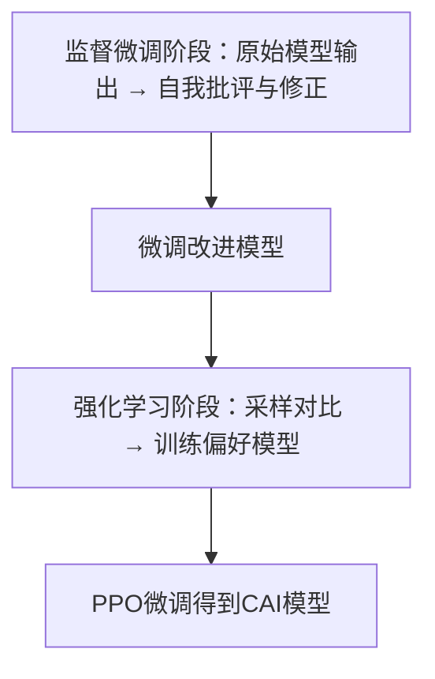

# 提示工程综述 (Prompt Engineering Survey)

> 本文档整合了学术前沿论文与业界实践，全面综述提示工程的技术演进、核心方法论、论文清单、行业案例及未来方向。

---

## 一、发展脉络：范式的演变

提示工程（Prompt Engineering, PE）的兴起标志着 NLP 处理范式的根本性转变：

1. **传统范式 (Pre-train, Fine-tune):** 针对特定任务微调模型参数。
   - 缺点：成本高，泛化性差。

2. **现代范式 (Pre-train, Prompt, Predict):** 模型参数固定，通过输入指令引导。
   - 优点：单一模型适配万千任务，零样本/少样本能力突出。

3. **工程化范式 (PE as an Engineering Discipline):** 提示词从简单的"话术"演变为包含**上下文、角色、逻辑约束和外部工具调用**的系统性工程。

---

## 二、核心方法论：技术分类体系

根据综述，提示技术可以从四个维度进行深度的分类：

### 1. 基础范式 (Foundational Paradigms)

| 技术 | 描述 | 适用场景 | 优点 | 缺点 |
|:-----|:-----|:---------|:-----|:-----|
| **Zero-shot (零样本)** | 直接下达指令，不提供示例 | 无训练/示例时做推断 | 不需示例，灵活 | 指令需清晰精炼 |
| **Few-shot (少样本)** | 提供少量"输入-输出"对 | 分类、QA、翻译等多样化任务 | 简单，无需训练 | 对示例质量敏感 |

### 2. 推理增强 (Reasoning-based Techniques)

解决模型逻辑推理不足（"幻觉"或跳跃性错误）的问题。

| 技术 | 描述 | 适用场景 | 优点 | 缺点 |
|:-----|:-----|:---------|:-----|:-----|
| **CoT (思维链)** | 引入"Step by step"提示，输出中间推理步骤 | 复杂推理、数学、逻辑 | 显著提升推理任务精度 | 需要演算过程示例 |
| **Self-Consistency (自洽性)** | 采样多个推理路径，通过投票法确定最终答案 | 复杂推理任务 | 平均掉推理错误，提高鲁棒性 | 多次采样成本高 |
| **Least-to-Most (由浅入深)** | 将复杂问题拆解为一系列子问题 | 多步推理 | 逐步解决问题 | 需要问题分解能力 |
| **Zero-shot CoT** | "Let's think step by step" 自动激发分步推理 | 无示例的推理任务 | 无需示例即可改进 | 并非对所有任务有效 |

### 3. 结构化思考 (Structural Thinking)

将线性思考扩展为更复杂的非线性数据结构。

| 技术 | 描述 | 适用场景 | 优点 | 缺点 |
|:-----|:-----|:---------|:-----|:-----|
| **ToT (思维树)** | 每一步探索多个分支，结合搜索算法(BFS/DFS)与自我评估 | 创意生成、游戏求解、复杂规划 | 解决线性方法失效的问题 | 搜索分支复杂度高 |
| **GoT (思维图)** | 允许推理节点之间的合并(Aggregation)和迭代(Looping) | 知识图谱构建、长篇系统方案 | 适用于多重信息整合的极复杂任务 | 实现复杂 |

### 4. 架构与工具增强 (Architecture & Tool Augmentation)

| 技术 | 描述 | 适用场景 | 优点 | 缺点 |
|:-----|:-----|:---------|:-----|:-----|
| **PoT (程序思维)** | 引导模型生成 Python 代码而非直接计算 | 科学计算、统计分析、复杂财务报表 | 将计算压力转移给外部解释器 | 需要执行环境 |
| **SoT (骨架思维)** | 第一步生成答案骨架，第二步并行填充内容 | 长文本生成 | 提升生成效率与逻辑连贯性 | 需要两步处理 |
| **ReAct (推理+行动)** | 在CoT输出中交替生成"思考"和"行动"(工具调用) | 需要外部信息的问题 | 增强模型解决需要外部信息问题的能力 | 需要构建工具接口 |

---

## 三、关键学术论文清单

以下按时间顺序列出提示工程领域具影响力的代表作：

### 3.1 基础提示方法

| 论文（中/英） | 作者 | 年份 | 会议 | 核心贡献 | 方法要点 | 优缺点 | 复现性 |
|:-------------|:-----|:----:|:----:|:---------|:---------|:-------|:-------|
| **语言模型是少样本学习者 (GPT-3)** | Brown et al. | 2020 | NeurIPS | 提出GPT-3，首次展示大模型仅靠少量示例即可解决新任务 | 在提示中给出任务定义及少量示例，利用模型规模解锁新能力 | ✅ 简单有效，无需微调<br>❌ 对提示敏感，示例分布影响大 | 部分重现：GPT-3 API可用 |
| **微调语言模型是零样本学习者 (FLAN)** | Wei et al. | 2021 | ICLR | 提出指令微调(Instruction Tuning)，通过多种任务的自然语言描述微调模型 | 利用模板将现有数据集转化为指令-响应格式，微调预训练模型 | ✅ 有效提升零样本泛化<br>❌ 需要收集多任务指令数据集 | 开源：Google发布FLAN系列模型 |
| **使语言模型更能遵循指令 (InstructGPT)** | Ouyang et al. | 2022 | NeurIPS | 引入RLHF训练流程，让模型更符合人类需求 | SFT → 训练奖励模型 → PPO强化学习 | ✅ 显著提升指令遵循性和安全性<br>❌ 需大量标注、复杂训练流程 | 部分复现：社区有实现 |

### 3.2 推理增强方法

| 论文 | 作者 | 年份 | 会议 | 核心贡献 | 方法要点 | 优缺点 | 复现性 |
|:-----|:-----|:----:|:----:|:---------|:---------|:-------|:-------|
| **思维链提示引发模型推理 (CoT)** | Wei et al. | 2022 | NeurIPS | 在少样本提示中给出完整演算过程示例，显著提高推理准确率 | 在示例中以多步推理过程引导模型输出答案 | ✅ 易于实现，提高复杂推理性能<br>❌ 对示例质量和任务类型敏感 | 可复现：论文附示例 |
| **大型语言模型是零样本推理者** | Kojima et al. | 2022 | NeurIPS | 发现简单在提示末尾加上"Let's think step by step"可在零示例条件下提高推理准确率 | 零样本情况下，加入CoT提示语句激发模型自行分步推理 | ✅ 无需示例即可改进<br>❌ 并非对所有任务有效 | 简单可复现 |
| **自洽性 (Self-Consistency)** | Wang et al. | 2022 | ICLR | 对同一问题多次采样不同推理链，然后对答案投票 | 利用采样生成多条链式推理路径并合并答案 | ✅ 可与任意CoT结合，稳步提升精度<br>❌ 采样成本高 | 可复现 |
| **Tree of Thoughts** | Yao et al. | 2023 | NeurIPS | 将CoT推广为树状思维，引入搜索与回溯 | 模型以搜索树方式生成候选"思维"，进行评估和回溯 | ✅ 在复杂任务中大幅优于线性CoT<br>❌ 实现复杂，搜索成本高 | 论文附伪码 |
| **自动CoT提示 (Auto-CoT)** | Zhang et al. | 2022 | ICLR | 通过聚类问题并利用零样本CoT自动生成示例 | 无需人工编写CoT示例，而是自动构造 | ✅ 降低手工成本<br>❌ 效果略低于人工设计 | 代码已开源 |

### 3.3 软提示与参数高效微调

| 论文 | 作者 | 年份 | 会议 | 核心贡献 | 方法要点 | 复现性 |
|:-----|:-----|:----:|:----:|:---------|:---------|:-------|
| **Prefix Tuning** | Li & Liang | 2021 | ACL | 提出冻结预训练模型，仅在输入嵌入加入可训练前缀向量 | 用少量参数实现任务微调 | Hugging Face PEFT库支持 |
| **Prompt Tuning** | Lester et al. | 2021 | EACL | 类似Prefix Tuning，使用可学习的嵌入向量作为"软提示" | - | PEFT支持 |
| **LoRA** | Hu et al. | 2021 | - | 将权重矩阵低秩分解并仅训练小矩阵 | 平衡性能与效率，成为业界标准之一 | HF PEFT库支持 |

### 3.4 其他重要方法

| 论文 | 年份 | 会议 | 核心贡献 |
|:-----|:----:|:----:|:---------|
| **Scratchpad / 逐步草稿** | 2021 | ICLR | 早期"草稿提示"思路，让模型逐步输出计算步骤 |
| **AutoPrompt** | 2020 | EMNLP | 自动搜索离散词串作为提示，引出BERT的知识 |
| **Chain-of-Verification (CoVe)** | 2023 | NAACL | 增加链式验证步骤以减少错误 |
| **Contrastive CoT (CCoT)** | 2023 | ICLR | 使用对比学习提高CoT回答一致性 |
| **Take a Step Back** | 2023 | NAACL | 让模型"后退一步"批判性思考 |

---

## 四、业界实践与案例研究

### 4.1 OpenAI：InstructGPT与ChatGPT

**流程：**

```mermaid
flowchart TD
    A[收集对话示例(SFT)] --> B[训练奖励模型]
    B --> C[进行PPO强化学习]
    C --> D[部署对话模型]
```

**核心要点：**
- **SFT阶段**：让人类标注员根据提示撰写"理想答案"
- **奖励模型**：收集多条模型回答并由人类排序
- **RLHF阶段**：通过PPO算法进行强化学习微调

**模板示例**：
```python
# 系统消息
system_message = "你是一个资深架构师，擅长系统设计..."
# 链式思考提示
chain_thought_prompt = "请逐步思考并解释你的推理过程..."
```

**效果与限制**：
- ✅ Annotators更偏好InstructGPT小模型(1.3B)输出
- ✅ 生成幻觉和有害输出明显减少
- ❌ 需要大量标注数据和复杂迭代训练

---

### 4.2 Anthropic：宪法AI (Constitutional AI)

**流程：**



**核心创新**：
- 用AI生成的"宪法规则"替代人工标签进行RLHF
- 第一阶段：模型自身生成批评和修正的答案
- 第二阶段：用"宪法"原则评估样本优劣

**效果**：在不额外采集有害标签数据的情况下降低模型有害性

---

### 4.3 Google：FLAN与Gemini

**核心实践**：
- **指令微调**：将大量任务数据转化为"给定指令->生成答案"格式
- **提示设计四要素**：角色(Persona)、任务(Task)、上下文(Context)、格式(Format)

**示例**：
```
你是一个项目经理，起草一份项目计划。
任务：根据以下会议记录，制定本周工作计划。
上下文：{会议记录内容}
格式：使用Markdown表格输出
```

---

### 4.4 Microsoft：Azure OpenAI

**提示工程指南**：
- 尽量具体、使用类比、强调关键信息
- 指令要明确具体、避免歧义，限制模型输出范围
- 系统消息设计来一致控制模型行为

---

### 4.5 Hugging Face：社区生态与工具

| 工具/库 | 描述 |
|:--------|:-----|
| **PEFT库** | 支持Prefix Tuning、Prompt Tuning、LoRA等参数高效微调 |
| **PromptSource** | 提示模板数据集和模板管理工具 |
| **Prompt Bench** | 评估平台 |
| **Prompt Perfect** | 自动优化提示工具 |

---

### 4.6 业界实践对比

| 公司/组织 | 实践描述 | 工程流程 | 效果与限制 | 开源链接 |
|:----------|:---------|:---------|:-----------|:---------|
| **OpenAI** | InstructGPT/ChatGPT，SFT+RLHF | SFT → 训练奖励模型 → PPO微调 | 效果显著、体验友好；成本高 | 官方博客 |
| **Anthropic** | 宪法AI(CAI)，用AI监督AI | 监督阶段→RLHF(训练偏好模型) | 减少有害输出；流程复杂 | CAI论文白皮书 |
| **Google** | Flan/Gemini，Instruction Tuning | 指令微调(多任务)→标准推理 | 强化零-shot能力；需管理数据隐私 | FLAN模型开源 |
| **Microsoft** | Azure OpenAI，集成并提供指南 | 无新训练；提供API使用与模板 | 方便企业上手；依赖外部模型 | MS Learn文档 |
| **Hugging Face** | 开源生态，PEFT等工具 | 社区驱动，支持各种实验 | 灵活、可复现；需挑选优质方法 | 文档与教程 |

---

## 五、可复现示例

### 示例1：指令跟随 – 文本摘要

**任务描述**：给定一段文字，要求模型生成摘要。

**输入**：
> 人工智能技术在近年来取得了飞跃性的进展，特别是在自然语言处理和计算机视觉等领域，应用场景不断扩大。

**输出**：
> 近年来，人工智能在自然语言处理和计算机视觉等领域取得了飞跃进展，应用场景不断扩大。

**提示模板**：
```
请将以下文本总结为一句话：
{text}
```

**模型设置**：
- 模型：OpenAI gpt-3.5-turbo 或类似模型
- 温度：0.7（适度创造性）
- max_tokens：50

**评估指标**：使用ROUGE衡量摘要与参考摘要的重叠

---

### 示例2：问答 – 常识问答

**任务描述**：回答提出的科学常识问题。

**输入**：
> 问题：超导体是什么？它有哪些应用？

**输出（CoT模式）**：
```
步骤1：超导体是一种在低温下电阻降为零的材料
步骤2：这种特性使其在多个领域有重要应用
最终：超导体用于制造高场强磁体（如MRI机器）、提高输电效率和量子计算等领域
```

**提示模板**：
```
问题：{question}
请逐步思考并回答：
```

---

### 示例3：代码生成 – 编程问题

**任务描述**：生成解决特定问题的Python代码。

**输入**：
> 请写一个Python函数，用于计算给定整数列表的平均值。

**输出**：
```python
def calculate_average(nums):
    if not nums:
        return 0
    return sum(nums) / len(nums)
```

**提示模板**：
```
请编写Python代码：
{instruction}
```

**模型设置**：
- 温度：0（确定性输出）
- max_tokens：100

---

## 六、提示设计通用原则

1. **角色设定 (Role Prompting)**：赋予模型特定身份（如"资深架构师"）

2. **明确约束 (Constraints)**：使用JSON、Markdown或No-nos列表规定输出形态

3. **上下文充分**：提供足够的背景信息帮助模型理解任务

4. **格式清晰**：明确指定输出格式（表格、列表、段落等）

5. **动态优化**：利用APE等工具让模型通过评估反馈自动迭代提示词

6. **少即是多**：避免过长且充满歧义的描述，确保核心指令的显著性

---

## 七、研究空白与未来方向

| 方向 | 描述 |
|:-----|:-----|
| **提示有效性理论基础** | 目前对为什么某些提示有效缺乏理论解释，需从注意力机制等角度分析 |
| **自动化与优化** | Auto-Prompting、Auto-Chain等在跨领域和跨语言场景下的挑战 |
| **对齐与安全** | 探索更好的人机反馈集成、无监督对齐（如CAI）和多样化安全评估 |
| **多模态提示** | 将图像、表格纳入提示，处理复杂视觉+文本任务 |
| **硬件与效率** | 高效的提示优化和部署，边缘设备上的快速调整 |
| **领域适应与泛化** | 设计通用提示使模型在特定领域（医疗、法律等）表现优秀 |

---

## 八、参考文献

1. Brown et al. "Language Models are Few-Shot Learners" (GPT-3), NeurIPS 2020
2. Wei et al. "Finetuned Language Models Are Zero-Shot Learners" (FLAN), ICLR 2021
3. Ouyang et al. "Training language models to follow instructions with human feedback" (InstructGPT), NeurIPS 2022
4. Wei et al. "Chain-of-Thought Prompting Elicits Reasoning in Large Language Models", NeurIPS 2022
5. Kojima et al. "Large Language Models are Zero-Shot Reasoners", NeurIPS 2022
6. Wang et al. "Self-Consistency Improves Chain of Thought Reasoning in Language Models", ICLR 2022
7. Yao et al. "Tree of Thoughts: Deliberate Problem Solving with Large Language Models", NeurIPS 2023
8. Lester et al. "The Power of Scale for Parameter-Efficient Prompt Tuning", EACL 2021
9. Hu et al. "LoRA: Low-Rank Adaptation of Large Language Models", 2021
10. Anthropic "Constitutional AI: Harmlessness from AI Feedback", 2022
11. Yao et al. "ReAct: Synergizing Reasoning and Acting in Language Models", ICLR 2022

---

*本文档整合自"The Art of Prompt Engineering: A Survey"(2024)及"提示工程：学术前沿与业界实践报告"(2026)*
