# 多实体问题下：普通向量检索 vs 融合图谱检索

> 起源：内部讨论（"刘备、关羽、张飞在哪里？"案例）—— 比较同一多实体问题在 **普通向量检索** 与 **融合图谱检索** 两种范式下，证据召回与最终答案质量的差异。

---

## 0. 一句话总结

**单点问题用向量检索完全够用；多实体问题必须用图谱（实体+关系+事件）来组织证据，再用图结构做重排序和动态补回，最后把多个证据片段组装成答案。** 评估要"看问题、看证据、看答案"三步分开检查，而不是只看最终答案。

---

## 一、技术背景

### 1.1 检索范式的两种主流选择

| 范式 | 核心机制 | 擅长 | 短板 |
|------|----------|------|------|
| **普通向量检索 (Vector Retrieval)** | 把 query 和文档嵌入同一向量空间，做 ANN 近邻匹配 | 语义相似度、同义改写、模糊匹配 | **多实体覆盖不均**、**关系语义丢失**、证据不可解释 |
| **融合图谱检索 (Graph-Enhanced Retrieval)** | 先建实体-关系-事件图，查询时按图节点 + 拓扑扩展证据 | **多实体联合**、**多跳关系**、**结构化推理** | 构建成本高、需要 NER/RE 流水线、查询路径需调优 |

### 1.2 核心问题：多实体查询为什么"翻车"

以 *"刘备、关羽、张飞在哪里？"* 为例：

- **三实体共现**：单条 query embedding 在语义上无法同时显式覆盖三个实体，向量会塌缩到"人物/三国"这种粗粒度主题上
- **关系节点缺失**：三人之间的核心关系（**桃园结义**）在向量空间里几乎无法被精确匹配——它是关系，不是命名实体
- **共享事件被切断**："三顾茅庐"、"黄巾起义"、"赤壁之战" 等事件同时涉及多个目标实体，纯 top-k 相似度排序会把它们分散到不同结果集中
- **结果解释难**：top-k 命中的 chunk 看上去 "topically 相似"，但其实并不直接回答问题

### 1.3 研究动机

文档型 QA 任务里"多实体问题"占比非常高（"X、Y、Z 有什么关系？"、"A 公司和 B 公司在 C 领域有哪些合作？"）。这类问题如果只用向量检索，**召回率低且证据链路不可解释**；融合图谱后能让系统沿着"实体→关系→事件→文档"的多跳路径收齐证据，**召回与可解释性同时提升**。

---

## 二、整体架构对比

```mermaid
flowchart TB
    subgraph Vec[普通向量检索 Pipeline]
        V1[Query Embedding] --> V2[ANN 近邻检索]
        V2 --> V3[Top-K Chunks]
        V3 --> V4[LLM 拼接生成答案]
    end

    subgraph Graph[融合图谱检索 Pipeline]
        G1[Query] --> G2[实体识别 NER + 关系抽取 RE]
        G2 --> G3[在图谱中定位实体节点 + 关系节点]
        G3 --> G4[邻居扩展:沿关系跳 1-2 跳]
        G4 --> G5[收集关联事件节点]
        G5 --> G6[回原文库拉取对应 Evidence Chunks]
        G6 --> G7[基于图结构重排序:实体参与度 / 关系权重 / 跳数]
        G7 --> G8[动态证据补回:把与多实体共同相关的新 chunk 拉回]
        G8 --> G9[LLM 组装多源证据生成答案]
    end
```



两条管线的关键差异：
- **Vec 路径**只走"语义相似度"一条线，证据来源单一
- **Graph 路径**走"识别→定位→扩展→回拉→排序→补回"六步，证据来源多样且带结构

---

## 三、案例拆解："刘备、关羽、张飞在哪里？"

### 3.1 知识图谱侧的数据形态

```
[刘备] ——桃园结义——> [关羽]
   │                       │
   └────桃园结义———> [张飞] ←——桃园结义───┘
   │                       │                       │
   ▼                       ▼                       ▼
[三顾茅庐]          [华容道]               [长坂坡]
   │
   └─ 涉及 [诸葛亮]
```

- **实体节点**：刘备、关羽、张飞、诸葛亮……
- **关系节点**：桃园结义、君臣、敌对……
- **事件节点**：桃园结义、三顾茅庐、华容道、长坂坡……

### 3.2 普通向量检索的失败模式

| 步骤 | 表现 |
|------|------|
| Query embedding | "刘备关羽张飞在哪里" 编码后偏向"三国人物/地点"主题 |
| ANN 检索 | 返回的 top-k 命中**分散**在三个不同人物的段落，可能漏掉"桃园结义"这个关键关系 |
| Top-K 拼接 | 三段独立的人物介绍拼在一起，**没有共同事件/共同关系** 的桥梁 |
| 答案 | 容易出现"答非所问"或"答不全"——比如只答了其中一人或只答了某地 |

### 3.3 融合图谱检索的工作流

1. **实体抽取** → 识别出三个目标实体：刘备、关羽、张飞
2. **关系抽取** → 识别"在哪里"暗含"位置/事件"类问题，可能涉及"桃园结义地"、"三顾茅庐地"、"华容道"等
3. **图谱定位** → 锁定 3 个实体节点 + 1 个核心关系节点（桃园结义）
4. **邻居扩展** → 沿关系跳到 [桃园结义地=涿郡]、[三顾茅庐=隆中]、[华容道] 等事件节点
5. **回原文库** → 把这些事件节点对应的 evidence chunk 从原始文档里拉回来
6. **图结构重排序** → 优先级 = 实体参与度 × 关系权重 / 跳数；"三人都参与"的事件排在最前
7. **动态证据补回** → 如果排序后发现还有关键 chunk 没召回（因为它们不与任何单一实体强相关），主动再拉一次
8. **LLM 组装** → 把"桃园结义地"+"三顾茅庐地"+"三人都经过"等 evidence 拼成完整答案

### 3.4 结果差异

| 维度 | 普通向量检索 | 融合图谱检索 |
|------|--------------|--------------|
| 召回证据数量 | 少且分散 | 多且成链 |
| 是否包含关系证据 | 几乎不包含 | 包含（桃园结义等） |
| 是否覆盖多实体共同事件 | 容易漏 | 显式覆盖 |
| 可解释性 | 弱（黑盒相似度） | 强（可看图路径） |
| 对"问全/问准"的支持 | 单点够用 | 多点必需 |

---

## 四、关键技术点

### 4.1 实体识别 + 关系抽取（NER + RE）
图谱检索的前置环节。需要把自然语言 query 解析成 `(实体, 关系, 实体)` 三元组或更复杂的事件参与结构。质量直接决定下游效果。

### 4.2 图节点定位 + 邻居扩展
- 实体 → 节点 ID 的映射（实体消歧 / 实体链接）
- 邻居扩展通常限定跳数（1-2 跳），否则组合爆炸
- 可用图算法：随机游走、子图匹配、PageRank-style 中心性

### 4.3 证据回拉（Graph → Text）
图节点命中后，要回原始文档库拉对应 evidence chunk。**常见做法**：
- 每个图节点关联若干个 chunk ID
- 拉回时去重 + 按图权重排序
- 控制总 token 上限

### 4.4 基于图结构的重排序（Graph-Aware Re-Ranking）
不只用语义相似度，而是叠加：
- **实体参与度**：同时涉及多实体的 chunk 优先
- **关系权重**：核心关系（如桃园结义）> 弱关系
- **跳数惩罚**：跳得越远权重越低
- **时间新鲜度**（如适用）

### 4.5 动态证据补回（Dynamic Evidence Fetch）
第一轮 evidence 集齐后，再做一次"补漏"：
- 检查每条 evidence 是否真的同时回答了多实体
- 对"答得不齐"的分支，**主动多走一跳**或换检索策略（向量补刀）
- 形成"图为主、向量为补"的混合策略

### 4.6 答案组装（Evidence Assembly）
最终 LLM 拿到的不是"top-k chunks"，而是"按图结构排好序的多源证据"——组装时更不容易遗漏关键关系。

---

## 五、特别标签观点与核心关联内容

### 观点 1：单点 vs 多点 —— 检索范式的转折信号

- **标签**: `Multi-Entity-Gap`, `Single-Hop-vs-Multi-Hop`
- **核心论点**: **问题中独立实体数量**是选择检索范式的首要信号。单点（1 个实体）走向量检索足够；多点（≥2 个独立实体且需要联合推理）必须上图谱。
- **关键证据**: "刘备、关羽、张飞在哪里？" 在向量检索下只能给出 1-2 个人的位置；图谱检索能完整给出三人都出现的事件及地点。
- **深层含义**: 系统入口处应做"实体计数 + 关系类型识别"，决定走 vec 路径还是 graph 路径。**别一上来就给所有问题套同一套 pipeline。**

### 观点 2：图谱检索的本质是"关系检索"而非"相似度检索"

- **标签**: `Graph-as-Relational-Retrieval`, `Topological-Evidence`
- **核心论点**: 融合图谱的真正优势**不在"找文档"，而在"找关系"**。实体-关系-事件构成的网络让系统能沿着拓扑结构扩展证据，而不是用向量相似度去"猜"。
- **关键证据**: "桃园结义" 在向量空间里基本无法精确匹配（它是关系不是实体），但在图谱里是一个 first-class 节点。
- **深层含义**: 设计图谱时，**关系节点必须显式建出来**，不能只把关系当作实体之间的边属性。

### 观点 3：多实体问题的"证据组装"是组合问题，不是单点匹配

- **标签**: `Evidence-Assembly`, `Multi-Entity-Composition`
- **核心论点**: 多实体问题需要把"每个实体的证据 + 实体间关系的证据 + 共同事件的证据"组装起来，**实体越多组合空间越大**。
- **关键证据**: 3 个实体各自有 5 条独立 evidence + 1 条共享关系 + 2 条共同事件 → 候选 evidence 集合需要剪枝和排序，而不是简单 concat。
- **深层含义**: 系统设计时必须考虑**证据爆炸**——要么靠图结构做剪枝，要么靠 LLM 做 selective 阅读。

### 观点 4：图谱增强的"动态证据补回"是 hybrid 的关键

- **标签**: `Dynamic-Evidence-Fetch`, `Hybrid-Retrieval`
- **核心论点**: 第一轮图谱检索可能漏掉"不与任何单一实体强相关但同时涉及多实体"的证据，必须**主动补回**这一类。
- **关键证据**: 用户原话"通过之后再和动态把关键证据补回来"——强调"再"和"动态"两个动作。
- **深层含义**: 单纯"图谱 + 向量"的两路召回不够，需要**二阶召回**（graph → text → re-check → re-fetch）。

### 观点 5：检索结果应基于"图结构权重"重排序，而非纯相似度

- **标签**: `Graph-Structure-Re-Ranking`, `Topology-Aware-Order`
- **核心论点**: 简单地把"图节点对应的 chunk"线性拼接交给 LLM 是不够的；必须按图结构（实体参与度、关系权重、跳数）重排序，**让最相关证据进入 LLM 上下文窗口的黄金位置**。
- **关键证据**: "需要把下载结果交给这个细节和今天通道设备的证据重新排序" —— 排序信号来自图结构。
- **深层含义**: 重排序是 graph retrieval 与 plain vector retrieval 的最大体感差异点。

### 观点 6：系统应"先承认问题"，再回答

- **标签**: `Question-First-Answer-Second`, `Honest-Retrieval`
- **核心论点**: 系统**第一时间的输出应该是"问题+证据状态"，而不是"最终答案"或"分数"**。证据不存在时，要能识别并显式回复"无法回答"。
- **关键证据**: "真正登记的第一时间不是给他最终答案，也不是给他分数，而是不是他问题" + "根据当年接受的资料，无法回答这个问题"。
- **深层含义**: 评估时不能只看答案对错，还要看"是否正确识别了证据缺失"。

### 观点 7：评估要"看问题、看证据、看答案"三步拆开

- **标签**: `Evaluation-Triplet`, `Question-Evidence-Answer`
- **核心论点**: 一个 QA 系统的质量 = `问题理解` × `证据检索` × `答案生成` 三者相乘。**只评估最终答案对错会掩盖前两步的问题**。
- **关键证据**: 用户原话反复强调"评估"、"三项技能"——指代三阶段评估。
- **深层含义**: 工程上要做可拆解的中间指标（实体识别准确率、图节点命中率、关系召回率），不能只跑 end-to-end accuracy。

### 观点 8：实体越多 ≠ 答案越长，需要"证据剪枝"

- **标签**: `Entity-Count-vs-Evidence-Explosion`
- **核心论点**: 三实体问题 ≠ 简单把三段 evidence 拼起来。**实体组合带来的 evidence 组合空间是超线性的**，必须显式剪枝。
- **关键证据**: 实际工程中常见"3 个实体 × 每人 5 个 evidence + 1 关系 + 2 共同事件" = 候选过多，LLM 上下文放不下。
- **深层含义**: 设计时就要预留"top-K + 关系过滤 + 共同事件优先"的剪枝策略。

---

## 六、对比小结

| 维度 | 普通向量检索 | 融合图谱检索 |
|------|--------------|--------------|
| **适用问题** | 单实体、单跳、模糊语义 | 多实体、多跳、结构化关系 |
| **证据召回** | topically 相似即可 | 实体命中 + 关系命中 + 事件命中 |
| **关系语义** | 弱（容易丢失） | 强（关系是 first-class） |
| **多实体联合证据** | 弱 | 强 |
| **可解释性** | 低 | 高（可看图路径） |
| **构建成本** | 低 | 高（需 NER/RE + 图构建） |
| **查询成本** | 低 | 中（图遍历 + 回拉 + 排序） |
| **答案质量** | 单点场景够用 | 多点场景显著更好 |

**结论**：**两类检索是互补关系，不是替代关系**。最优系统通常 = `向量检索（召回） + 图谱检索（结构化） + 图结构重排序（精排） + 动态证据补回（兜底）`。

---

## 七、对实践的启示

1. **入口分流**：query 进入时先做实体识别 + 实体计数。单实体走 vec 路径；多实体走 graph 路径。**别一套 pipeline 打天下**。
2. **图谱里要把"关系"建成 first-class 节点**，不要只做实体之间的边。桃园结义这种关系本身就是答案核心。
3. **重排序信号必须是混合的**：语义相似度 + 图结构（实体参与度、关系权重、跳数）+ 时间/新鲜度。**纯相似度排序在多实体问题上会失败**。
4. **预留"动态补回"通道**：第一轮召回可能漏掉关键共同事件，需要二阶检索（向量补刀、图再扩展一跳）。
5. **证据组装阶段给 LLM 的应是"排序好的多源证据"**，不是"top-k chunks"。**结构化 prompt + 结构化 context**。
6. **答案生成前先做"证据-问题一致性检查"**：证据不足要能显式说"无法回答"，不要硬凑。
7. **评估要三段拆开**：实体识别准确率、图节点/关系召回率、最终答案准确率，**end-to-end 指标会掩盖前两步的退化**。

---

## 八、潜在风险与局限

1. **NER/RE 的误差会被图谱放大**：实体识别错了，整个图节点定位都会偏。需要 NER 质量门禁。
2. **图谱构建成本高**：从无到有建一张覆盖业务问题的图需要标注 + 流水线 + 维护，不是每个项目都值得。
3. **跨域通用性差**：一张图只服务一个领域；想覆盖多领域需要联邦图或共享本体。
4. **实体消歧难**：同名实体（"刘备"指历史人物还是某款游戏角色）会污染图谱。
5. **图遍历的尾延迟**：节点多 + 跳数深时，实时性会变差，需要提前做索引/缓存。

---

## 九、相关引用与延伸阅读

- 内部案例："刘备、关羽、张飞在哪里？" — 多实体问题经典样本
- [[LLM Wiki]] 中关于"知识图谱 + Schema 层"的章节 —— 互补的另一种知识组织范式
- [[Is Grep All You Need?]] 论文 —— 讨论另一种非向量检索范式（lexical/grep），可作为"非向量检索"的另一极
- 关系图谱领域：Neo4j、TuGraph、华为 GraphBase、阿里 GraphScope
- 知识图谱 + LLM：GraphRAG（Microsoft Research, 2024）、ToG (Think-on-Graph)、RoG (Retrieval-Augmented on Graphs)
- 多跳 QA：HotpotQA、2WikiMultihopQA

---

## 十、关键术语速查

| 术语 | 含义 |
|------|------|
| **普通向量检索** | Query 和文档都嵌入向量空间，ANN 检索 top-k |
| **融合图谱检索** | 在向量检索之外，叠加实体-关系-事件图谱，按图结构扩展证据 |
| **多实体问题** | Query 中同时出现 ≥2 个独立命名实体，需要联合推理 |
| **关系节点** | 图谱中 first-class 的"关系"（如"桃园结义"），不仅是边 |
| **事件节点** | 图谱中可挂载多实体的"事件"（如"三顾茅庐"） |
| **动态证据补回** | 第一轮召回后主动再拉一轮"漏掉但关键"的 evidence |
| **图结构重排序** | 用图上的拓扑信号（参与度、权重、跳数）做精排 |
| **证据组装** | 把多源 evidence 按结构组合成最终答案 |
| **三段评估** | 问题理解 / 证据检索 / 答案生成三段拆开评估 |
